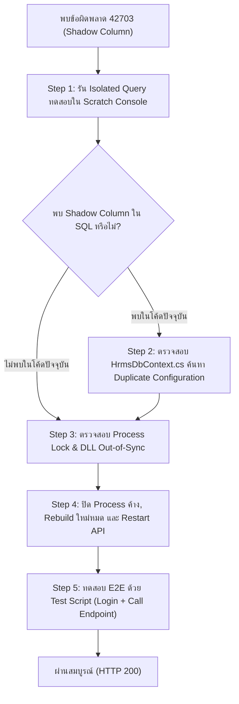

# EF Core Runtime Query & Process Troubleshooting Skill (HRMS)

ทักษะและคู่มือปฏิบัติการมาตรฐาน (Standard Runbook) สำหรับวิเคราะห์และแก้ไขปัญหาข้อผิดพลาดระดับ Runtime ของ Entity Framework Core (EF Core) และ PostgreSQL ในระบบ HRMS
รวมถึงกระบวนการตรวจจับปัญหาซับซ้อนที่เกิดจาก **Shadow Foreign Key**, **Duplicate Entity Configuration** และ **Process File Lock (Out-of-Sync DLLs)**

---

## 🧭 เมื่อใดที่ควรใช้ทักษะนี้ (Trigger Scenarios)

1. **PostgreSQL Runtime Error 42703 (`column does not exist`):**
   - เช่น `column e7.EmployeeId1 does not exist`, `column a1.DepartmentId1 does not exist`
   - ข้อผิดพลาดเกิดขึ้นเฉพาะตอน Query ผ่าน EF Core ทั้งที่ไม่มีคอลัมน์ดังกล่าวใน Entity Model หรือ Database
2. **แก้โค้ดหรือดึงโค้ดล่าสุดแล้วแต่ยัง Error เดิม:**
   - โค้ดใน Git ถูกต้องแล้ว แต่เรียก API จริงยังคงติด Error เดิม
   - มีข้อสงสัยว่าเซิร์ฟเวอร์รันด้วย Binary หรือ In-Memory Model ตัวเก่า
3. **Build ติด File Lock (`MSB3026` / `MSB3027`):**
   - เกิดข้อความเตือน `Could not copy ... The file is locked by: Hrms.Api`
4. **ความสัมพันธ์ของ Entity ทำงานผิดปกติ (EF Core Mapping Discrepancy):**
   - ผลลัพธ์จากการ `.Include()` มีการ Join คอลัมน์แปลกปลอม หรือ EF Core สร้าง Shadow Properties โดยไม่ตั้งใจ

---

## 🔬 กายวิภาคของปัญหา (Anatomy of the Error)

### 1. EF Core Shadow Foreign Key (`XxxId1`) เกิดขึ้นได้อย่างไร?
เมื่อ EF Core ตรวจพบความสัมพันธ์ (Relationship) ระหว่างสอง Entity ที่ **คลุมเครือ (Ambiguous)** หรือมี **การตั้งค่าซ้ำซ้อน (Duplicate Mapping)** ตัวอย่างเช่น:

```csharp
// บล็อกที่ 1: กำหนดความสัมพันธ์แบบมี Inverse Navigation ชัดเจน
modelBuilder.Entity<EmployeeSignature>(entity =>
{
    entity.HasOne(e => e.Employee)
        .WithMany(e => e.Signatures)
        .HasForeignKey(e => e.EmployeeId);
});

// บล็อกที่ 2 (ส่วนเกิน/ซ้ำซ้อน): อยู่ห่างออกไปอีกจุดหนึ่งใน DbContext
modelBuilder.Entity<EmployeeSignature>(entity =>
{
    entity.HasOne(e => e.Employee)
        .WithMany() // ไม่มี inverse
        .HasForeignKey(e => e.EmployeeId);
});
```

* **ผลลัพธ์ของ EF Core:**
  1. EF Core สันนิษฐานว่า Entity ทั้งสองมีความสัมพันธ์กัน **2 เส้นทางที่แยกจากกัน**
  2. เส้นทางแรกผูกกับ Foreign Key `EmployeeId`
  3. เส้นทางที่สอง EF Core สันนิษฐานว่าต้องมี Foreign Key อีกตัว จึงสร้าง **Shadow Property** ขึ้นมาในหน่วยความจำโดยอัตโนมัติชื่อ **`EmployeeId1`**
  4. เมื่อมีการสั่ง Query เช่น `.Include(e => e.Signatures)` ตัว Query Provider จะแปลงคำสั่งเป็น SQL ที่มี `e7.EmployeeId1`
  5. เมื่อส่งคำสั่ง SQL ไปยัง PostgreSQL จะถูกปฏิเสธทันทีด้วยรหัส **`42703: column e7.EmployeeId1 does not exist`**

---

### 2. ปัญหาแฝง: Process File Lock และ Out-of-Sync DLLs
* บ่อยครั้งที่ทีมงานคนอื่น (เช่น Dev 2) หรือตัวเราเองได้แก้ปัญหา Duplicate Mapping ไปแล้วใน Git
* แต่ถ้าเซิร์ฟเวอร์ Backend (`dotnet run` หรือ `Hrms.Api.exe`) **ถูกเปิดทิ้งไว้ใน Terminal ก่อนที่จะ Pull/Merge โค้ด**:
  - ตัว Process จะถือ **File Lock** ไฟล์ `.dll` ในโฟลเดอร์ `bin/Debug/net10.0/`
  - เมื่อสั่ง `dotnet build` หรือรันโปรเจกต์ใหม่ ระบบจะขึ้น Warning/Error ไม่สามารถเขียนทับ DLL เดิมได้
  - เซิร์ฟเวอร์บนพอร์ต 5229 จึงยังคงรันด้วย In-Memory Model ตัวเก่า ส่งผลให้ทดสอบอย่างไรก็ยังเจอ Error เดิม

---

## 🛠️ ขั้นตอนปฏิบัติการ 5 ขั้นตอน (The 5-Step Playbook)



---

### ขั้นตอนที่ 1: ตรวจสอบ Query ด้วย Isolated Scratch Console
เพื่อแยกแยะว่าปัญหาอยู่ที่ **EF Core Model ในโค้ดปัจจุบัน** หรือเป็นเพราะ **ฐานข้อมูลขาดคอลัมน์/Process เก่ารันอยู่**:

1. สร้าง Scratch Console App ชั่วคราว (ไม่ต้องสร้างในโปรเจกต์หลัก):
   ```powershell
   dotnet new console -n check_model -o scratch/check_model
   dotnet add scratch/check_model reference backend/src/Hrms.Infrastructure/Hrms.Infrastructure.csproj
   ```
2. เขียนคำสั่งทดสอบใน `scratch/check_model/Program.cs`:
   ```csharp
   using Microsoft.EntityFrameworkCore;
   using Hrms.Infrastructure.Persistence;

   var options = new DbContextOptionsBuilder<HrmsDbContext>()
       .UseNpgsql("<Connection_String_From_appsettings.json>")
       .Options;

   using var db = new HrmsDbContext(options);

   var query = db.Employees
       .Include(e => e.Signatures) // หรือ Entity ที่มีปัญหา
       .Where(e => e.Id == 1);

   // ตรวจสอบ Generated SQL
   string sql = query.ToQueryString();
   Console.WriteLine(sql);

   if (sql.Contains("EmployeeId1"))
       Console.WriteLine("❌ พบ Shadow Property ในโค้ดปัจจุบัน!");
   else
       Console.WriteLine("✅ โค้ดปัจจุบันสะอาด ไม่มี Shadow Property");

   // ยิงทดสอบจริงกับ DB
   var result = await query.FirstOrDefaultAsync();
   Console.WriteLine($"DB Query Success: {result?.FullName}");
   ```
3. สั่งรัน `dotnet run`:
   - หาก `ToQueryString()` มี `EmployeeId1` แสดงว่าโค้ดปัจจุบันใน `HrmsDbContext.cs` ยังมี Mapping ซ้ำซ้อน (ไปขั้นตอนที่ 2)
   - หาก `ToQueryString()` สะอาดและ DB Query Success แต่ API เซิร์ฟเวอร์จริงยัง Error แสดงว่า **Process Backend ค้างและรัน Binary เก่า** (ไปขั้นตอนที่ 3)

---

### ขั้นตอนที่ 2: ตรวจสอบและแก้ไข `HrmsDbContext.cs`
1. ค้นหาชื่อ Entity ที่ติดปัญหาใน `HrmsDbContext.cs`:
   ```powershell
   # ใช้ ripgrep ค้นหาการประกาศ Entity
   rg "modelBuilder\.Entity<EmployeeSignature>" backend/src/Hrms.Infrastructure/Persistence/HrmsDbContext.cs
   ```
2. ตรวจสอบว่ามีบล็อก `modelBuilder.Entity<T>` ซ้ำกันมากกว่า 1 บล็อกหรือไม่
3. ตรวจสอบ Navigation Properties ของทั้งสองฝั่ง:
   - ฝั่ง Parent (`Employee`): ต้องมี `public virtual ICollection<EmployeeSignature> Signatures { get; set; }`
   - ฝั่ง Child (`EmployeeSignature`): ต้องมี `public virtual Employee Employee { get; set; }`
   - การตั้งค่าใน Fluent API:
     ```csharp
     entity.HasOne(e => e.Employee)
         .WithMany(e => e.Signatures)
         .HasForeignKey(e => e.EmployeeId)
         .OnDelete(DeleteBehavior.Cascade);
     ```
4. ลบบล็อกที่ซ้ำซ้อนออกทั้งหมดให้เหลือเพียงจุดเดียวที่ถูกต้อง

---

### ขั้นตอนที่ 3: ตรวจสอบ Process และปลด File Lock
ตรวจสอบว่ามี Process Backend เก่ารันค้างอยู่บนพอร์ต 5229 หรือไม่:

1. ตรวจสอบ PID ที่กำลัง Listen อยู่บนพอร์ต 5229:
   ```powershell
   Get-NetTCPConnection -LocalPort 5229 -ErrorAction SilentlyContinue | Select-Object LocalAddress, LocalPort, OwningProcess, State
   ```
2. ดูรายละเอียด Process (เช่น เริ่มทำงานตั้งแต่เมื่อไหร่, รันจากไฟล์ไหน):
   ```powershell
   Get-Process -Name dotnet, Hrms.Api -ErrorAction SilentlyContinue | Select-Object Id, ProcessName, StartTime, Path
   ```
3. สั่งปิด Process ที่ค้างอยู่เพื่อปลด File Lock ทันที:
   ```powershell
   Stop-Process -Id <PID_1>, <PID_2> -Force -ErrorAction SilentlyContinue
   ```
4. ตรวจสอบซ้ำว่าพอร์ต 5229 ถูกปล่อยว่างแล้ว

---

### ขั้นตอนที่ 4: Clean Rebuild และเริ่มรัน Service ใหม่
1. รัน Build โครงการ Backend แบบ Clean เพื่อให้แน่ใจว่า DLL ถูกเขียนทับใหม่ทั้งหมด:
   ```powershell
   dotnet build backend/src/Hrms.Api/Hrms.Api.csproj
   ```
   *เกณฑ์ผ่าน:* ต้องได้ **0 Errors**
2. รัน Service ใหม่:
   ```powershell
   dotnet run --project backend/src/Hrms.Api/Hrms.Api.csproj
   ```
3. ตรวจสอบ Log ให้แน่ใจว่าขึ้น:
   `Now listening on: http://localhost:5229`
   `Application started.`

---

### ขั้นตอนที่ 5: ตรวจสอบแบบ End-to-End ด้วย API Script
เขียนหรือรันสคริปต์ PowerShell เพื่อ Login และยิงเรียก Endpoint ที่เคยมีปัญหา:

```powershell
# ตัวอย่างสคริปต์ scratch/test_api.ps1
$loginBody = '{"username":"admin","password":"Admin#2026!Sec"}'
$loginRes = Invoke-RestMethod -Uri 'http://localhost:5229/api/auth/login' -Method Post -Body $loginBody -ContentType 'application/json'
$token = $loginRes.data.token
$headers = @{ Authorization = "Bearer $token" }

try {
    $empRes = Invoke-RestMethod -Uri 'http://localhost:5229/api/employees/1' -Method Get -Headers $headers
    Write-Output "SUCCESS: $($empRes.data.firstName) $($empRes.data.lastName)"
} catch {
    Write-Output "FAILED: $($_.Exception.Message)"
}
```

และตรวจสอบ Frontend Build/Type Check:
```powershell
cd frontend
npx tsc --noEmit
```

---

## 📋 เช็กลิสต์ป้องกันสำหรับนักพัฒนา (Prevention Checklist)

- [ ] **ห้ามประกาศ `modelBuilder.Entity<T>` ซ้ำใน `HrmsDbContext.cs`:** ค้นหาชื่อ Entity ก่อนเริ่มเขียนบล็อก Config ใหม่เสมอ
- [ ] **ระบุ Inverse Navigation เสมอ:** หาก Entity ฝั่ง Parent มี Collection Navigation ให้ระบุใน `.WithMany(x => x.CollectionName)` แทนการใส่ `.WithMany()` เปล่า
- [ ] **Restart Backend เสมอหลัง Git Pull/Merge:** ทุกครั้งที่มีการดึงโค้ดจากเพื่อนร่วมทีม หรือ Merge เข้า branch ทำการ Restart API เพื่อหลีกเลี่ยง In-Memory Model Desync
- [ ] **สังเกต Build Warning MSB3026/MSB3027:** หากเห็น Warning เรื่อง file locked ให้หยุด Process และ Rebuild ใหม่ทันที อย่าปล่อยผ่าน
