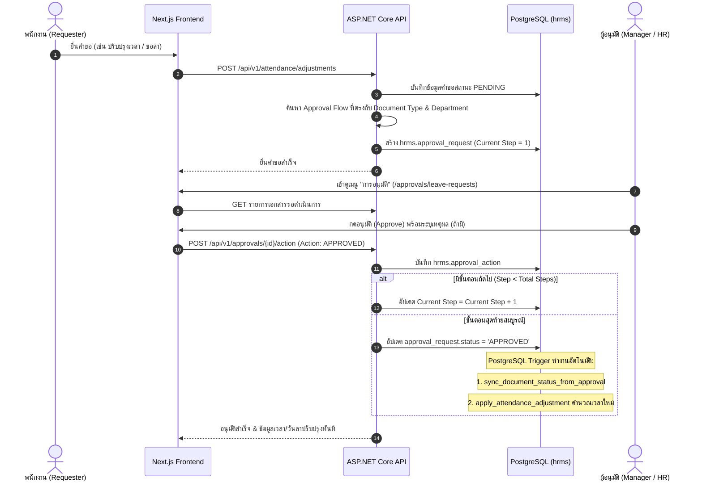

# HRMS Approval Flow & Navigation Standards Skill

ทักษะและแนวทางปฏิบัติมาตรฐานสำหรับระบบบริหารจัดการทรัพยากรบุคคล (HRMS) ครอบคลุม 2 แกนหลักสำคัญที่พัฒนาและสรุปเป็นมาตรฐานของระบบ:
1. **ระบบสายการอนุมัติ (Approval Workflow Engine & Lifecycle):** กลไกสายอนุมัติแบบตรงไปตรงมา (Direct Multi-Step Approval without Delegation)
2. **ระบบเมนูย่อยและ Breadcrumb มาตรฐาน (Sub-Navigation Tabs & Breadcrumb Architecture):** รูปแบบเมนูย่อยและระบบระบุตำแหน่งหน้าจอที่ซิงโครไนซ์ถูกต้องทั้งระบบ

---

## 🏛️ PART 1: ระบบสายการอนุมัติ (Approval Workflow Engine)

### 1.1 ปรัชญาและโครงสร้างการอนุมัติ (Core Principles)
- **ไม่ใช้ระบบมอบหมายแทน (No Delegation Policy):** ตัดความซ้ำซ้อนของการโอนสิทธิ์หรือรักษาการแทนออก เพื่อให้สายการอนุมัติสั้น ชัดเจน ตรวจสอบย้อนหลัง (Audit Trail) ได้ง่าย และโปร่งใส 100%
- **ลำดับขั้นหลายระดับ (Multi-Step Chain):** แต่ละเอกสารสามารถกำหนดสายอนุมัติได้หลายขั้นตอน (Step 1 -> Step 2 -> ...)
- **ประเภทผู้อนุมัติที่รองรับ (Approver Types):**
  - `MANAGER`: หัวหน้างานโดยตรงของผู้ยื่นคำขอ (อ้างอิงจากสายบังคับบัญชาใน `hrms.employee` หรือ `hrms.employee_assignment`)
  - `SPECIFIC_EMPLOYEE`: ระบุเจาะจงตัวพนักงานผู้อนุมัติรายบุคคล
  - `ROLE`: อนุมัติตามบทบาทในระบบ เช่น `HR_ADMIN`, `EXECUTIVE`, `CEO`

### 1.2 โครงสร้างตารางในฐานข้อมูล (Database Schema)
```
hrms.approval_flow ──1:N──> hrms.approval_flow_step
       │
       └──1:N──> hrms.approval_request ──1:N──> hrms.approval_action
```

- `hrms.approval_flow`: แม่แบบสายการอนุมัติ (Document Type, Code, Name, Scope: Department/Company, IsActive)
- `hrms.approval_flow_step`: ลำดับขั้นตอนในสาย (Step Order, Step Name, Approver Type, Specific Approver ID, Approver Role)
- `hrms.approval_request`: รายการคำขอที่ถูกส่งเข้าสู่ระบบ (Document Type, Document ID, Requester ID, Current Step, Status: `PENDING`, `APPROVED`, `REJECTED`, `CANCELLED`)
- `hrms.approval_action`: บันทึกประวัติการกดอนุมัติ/ปฏิเสธ (Step Number, Approver ID, Action: `APPROVED`/`REJECTED`, Comment, Action Date)

### 1.3 ลำดับขั้นตอนการทำงานแบบ End-to-End (Workflow Lifecycle)


### 1.4 การจัดการ UI สายการอนุมัติในหน้าตั้งค่า
- หน้ารวมการตั้งค่าสายการอนุมัติติดตั้งอยู่ที่แท็บ: `/settings?tab=approval-flows`
- เมนูย่อยใน `settings/page.tsx` มี 4 แท็บ: `ผู้ใช้งาน`, `บทบาทและสิทธิ์`, `บันทึกการใช้งานระบบ (Audit Log)`, `สายการอนุมัติ`
- รองรับการเปิด Drawer เพื่อเพิ่ม/แก้ไขขั้นตอนสายการอนุมัติ และสลับลำดับขั้นตอน (Step 1, Step 2) อย่างปลอดภัย

---

## 🎨 PART 2: มาตรฐานแถบเมนูย่อยและ Breadcrumb (Sub-Navigation & Breadcrumbs)

### 2.1 มาตรฐานแถบเมนูย่อย (Sub-Navigation Tabs Specification)
อ้างอิงจากต้นแบบของ **เมนูพนักงาน** (`frontend/src/app/(admin)/employees/page.tsx`):

```tsx
{/* Sub Navigation Bar - Standardized to Employee Module */}
<div className="border-b border-slate-200 bg-white px-4 -mt-2 rounded-t-2xl">
  <nav className="flex space-x-6 overflow-x-auto no-scrollbar py-2 text-[13px] font-medium">
    {tabs.map((tab) => {
      const isActive = activeTab === tab.key;
      return (
        <button
          key={tab.key}
          type="button"
          onClick={() => setActiveTab(tab.key)}
          className={`py-2 whitespace-nowrap transition-all border-b-2 font-medium cursor-pointer ${
            isActive
              ? 'border-[#0B2046] text-[#0B2046] font-bold'
              : 'border-transparent text-slate-500 hover:text-slate-900 hover:border-slate-300'
          }`}
        >
          {tab.label}
        </button>
      );
    })}
  </nav>
</div>
```

#### กฎเหล็กของแถบเมนูย่อย:
1. **Container Wrapper:** ต้องใช้ `border-b border-slate-200 bg-white px-4 -mt-2 rounded-t-2xl` เพื่อให้ชิดขอบบนของการ์ดเนื้อหาอย่างสวยงาม
2. **Nav Element:** ต้องใช้ `space-x-6 overflow-x-auto no-scrollbar py-2 text-[13px] font-medium`
3. **Active/Inactive State:**
   - Active: `border-[#0B2046] text-[#0B2046] font-bold` (เส้นล่างสีน้ำเงินเข้มตัวหนา)
   - Inactive: `border-transparent text-slate-500 hover:text-slate-900 hover:border-slate-300`
4. **Minimalist Style:** **ไม่ใส่ไอคอนหน้าแท็บ** (ยกเว้น badge ตัวเลขนับรายการรอดำเนินการขนาดกะทัดรัด) และไม่ใส่แถบ Breadcrumb หรือปุ่มลูกศรย้อนกลับซ้ำซ้อน เพราะแถบด้านบน (`Navbar.tsx`) มี Breadcrumb และปุ่มย้อนกลับคอยควบคุมอยู่แล้ว

---

### 2.2 สถาปัตยกรรมระบบ Breadcrumb แบบซิงโครไนซ์สมบูรณ์ (Zero-Leak Breadcrumbs)

#### 1. การป้องกัน Stale Breadcrumb Leak ใน `BreadcrumbContext.tsx`
จัดเก็บ Breadcrumb พร้อมกับ `currentPathname` เพื่อให้เคลียร์สถานะทิ้งทันทีที่มีการสลับ Route:
```tsx
export const BreadcrumbProvider: React.FC<{ children: React.ReactNode }> = ({ children }) => {
  const currentPathname = usePathname();
  const [breadcrumbState, setBreadcrumbState] = useState<{
    pathname: string;
    item: BreadcrumbItem | null;
  }>({
    pathname: '',
    item: null,
  });

  const setBreadcrumb = React.useCallback(
    (item: BreadcrumbItem | null) => {
      setBreadcrumbState({
        pathname: currentPathname,
        item,
      });
    },
    [currentPathname]
  );

  // จะถือว่า Breadcrumb มีผลเฉพาะเมื่อตั้งบน pathname ปัจจุบันเท่านั้น
  const breadcrumb = breadcrumbState.pathname === currentPathname ? breadcrumbState.item : null;

  return (
    <BreadcrumbContext.Provider value={{ breadcrumb, setBreadcrumb }}>
      {children}
    </BreadcrumbContext.Provider>
  );
};
```

#### 2. การทำ Fallback Route Mapping ใน `Navbar.tsx`
เรียงลำดับ Sub-routes ที่เฉพาะเจาะจงขึ้นก่อนเสมอ:
- `/employees/types` ➔ `พนักงาน / ประเภทพนักงาน`
- `/employees/contracts` ➔ `พนักงาน / สัญญาจ้าง`
- `/employees/transfers` ➔ `พนักงาน / การโอนย้ายพนักงาน`
- `/ess/attendance` ➔ `บันทึกเวลาของฉัน (ESS) / ตรวจบันทึกเวลาของฉัน`
- `/documents/history` ➔ `ยื่นเอกสาร / ประวัติเอกสาร`
- `/documents/leave` ➔ `ยื่นเอกสาร / ยื่นคำขอลา`
- `/attendance/daily` ➔ `ตรวจบันทึกเวลา / ตรวจบันทึกเวลาประจำวัน`
- `/attendance/schedules` ➔ `การจัดตารางงาน / มอบหมายกะให้พนักงาน`
- `/approvals/history` ➔ `การอนุมัติ / ประวัติเอกสาร`
- `/approvals/leave-requests` ➔ `การอนุมัติ / เอกสารรอดำเนินการ`
- `/settings` ➔ `ตั้งค่า / ผู้ใช้งาน`

#### 3. การเชื่อมโยง `setBreadcrumb` กับ `activeTab` ในระดับ Component
เมื่อหน้าเพจมี Sub-tabs ให้ใส่ `useEffect` เพื่ออัปเดต Breadcrumb ทุกครั้งที่ `activeTab` มีการเปลี่ยนแปลง:
```tsx
const { setBreadcrumb } = useBreadcrumb();

useEffect(() => {
  setBreadcrumb({
    section: 'ชื่อเมนูหลัก',
    page: tabLabelMap[activeTab] || 'หน้าเริ่มต้น',
  });
  return () => setBreadcrumb(null);
}, [activeTab, setBreadcrumb]);
```

---

## 🛠️ PART 3: คู่มือแก้ปัญหาข้อผิดพลาดทางเทคนิค (Troubleshooting Checklist)

### 3.1 Dependency Injection Resolution (`Unable to resolve service for type`)
- **สาเหตุ:** Controller มีการเรียกใช้งาน Service Interface (เช่น `IUserService`) แต่ใน `Program.cs` ไม่ได้ลงทะเบียนผ่าน `builder.Services.AddScoped<IUserService, UserService>()`
- **วิธีแก้:** ตรวจสอบ Constructor ของ Controller แล้วเพิ่มการ Register Service ใน `backend/src/Hrms.Api/Program.cs` หรือ Extensions ที่เกี่ยวข้อง

### 3.2 การล็อกไฟล์ DLL ขณะ Build Backend (`MSB3021 / MSB3027: file is locked by Hrms.Api`)
- **สาเหตุ:** เบื้องหลังกำลังรัน `dotnet run` (Hrms.Api process) อยู่ ทำให้ระบบปฏิบัติการล็อกไฟล์ `Hrms.Domain.dll`, `Hrms.Application.dll`, `Hrms.Infrastructure.dll`
- **วิธีแก้:** สั่งยุติ (Kill/Stop) Task ที่รัน API อยู่ก่อน จากนั้นรัน `dotnet build` ให้เสร็จสิ้น แล้วค่อยเริ่ม process API ใหม่อีกครั้ง

### 3.3 การปฏิบัติตาม Git Branching Protocol (`AGENTS.md`)
1. **ห้ามทำบน master เด็ดขาด**
2. สร้าง Branch ใหม่ตามประเภทงาน:
   - `feat/<feature-name>` (ฟีเจอร์ใหม่)
   - `fix/<bug-name>` (แก้บัก)
   - `chore/<task-name>` (งานโครงสร้าง/เอกสาร/skill)
3. ตรวจสอบคุณภาพจนผ่าน 0 Errors:
   - `npx tsc --noEmit`
   - `npm run build`
   - `dotnet build`
4. Merge เข้า `master` และ `git push origin master`
