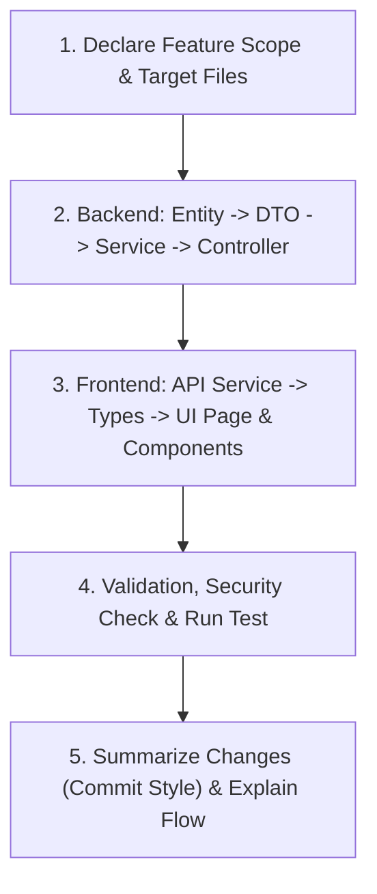

# Enterprise HRMS Development Skill & Standard Operating Procedure

This skill defines the technical standards, architectural patterns, workflow rules, and feature blueprints for building the Enterprise Human Resource Management System (HRMS) using **Next.js (Frontend)**, **ASP.NET Core Web API (Backend)**, and **PostgreSQL (`hrms` schema)**.

---

## 📜 10 Strict Development Rules (กติกาเหล็ก 10 ข้อ)

All AI agents and developers working on this codebase must strictly observe these 10 rules:

1. **ห้ามเขียนโค้ดทันที (Never Code Immediately):** Do not generate or modify production code without prior requirement and schema analysis.
2. **วิเคราะห์ Schema & ขอบเขตก่อนเสมอ (Analyze DDL & Scope First):** Review the PostgreSQL schema, constraints, triggers, and business scope, summarizing understanding before taking action.
3. **วางแผนไฟล์ โมดูล และลำดับก่อนเริ่ม (Plan Files & Execution Order):** Decompose the system into small, digestible vertical-slice features. Identify all files to be created/modified and their exact roles.
4. **รอการอนุมัติก่อนลงมือ (Awaiting Explicit Approval):** The developer/user must approve the plan before execution begins for any feature.
5. **แจ้งล่วงหน้าก่อนแก้ไฟล์ (Announce Files in Advance):** Explicitly list the exact files to be created or modified before touching the filesystem.
6. **สรุปสิ่งที่ทำเสมือน Commit Message (Summarize Like a Commit):** After finishing a feature/round, summarize all changes with precision (Added, Modified, Fixed).
7. **ห้ามแก้ไฟล์นอกเหนือ Scope (No Unrelated File Edits):** Strictly preserve existing code outside the active feature. Do not delete or modify unrelated modules.
8. **เขียนโค้ดอ่านง่าย มีคอมเมนต์ (Clean Code for Beginners & Seniors):** Write maintainable, self-documenting code with meaningful Thai/English comments explaining the "why", not just the "what".
9. **ความปลอดภัยและ Best Practices ของ HRMS (Security & HRMS Standards):**
   - **PDPA / Privacy:** Encrypt sensitive fields (`citizen_id`, `social_security_no`) with AES-256 into `bytea` columns; expose `_masked` versions in standard APIs.
   - **Data Scoping:** Enforce `role_data_scope` filters (`SELF`, `TEAM`, `DEPARTMENT`, `DIVISION`, `ORGANIZATION`).
   - **Financial Privacy:** Salary and payroll records must never leak across unauthorized roles.
   - **Audit Trail:** Log all critical create/update/delete/export operations into `hrms.audit_log`.
10. **อธิบายการทำงานหลังทำเสร็จ (Post-Feature Explanation):** Detail the responsibilities of each file, the end-to-end data flow, and any security/sensitive considerations.

---

## 🏛️ System Architecture & Tech Stack

```
Frontend: Next.js (App Router, Tailwind CSS, Lucide Icons, Axios Client)
              │
              ▼ REST API (JWT + RBAC + Data Scope Claims)
Backend:  ASP.NET Core 8/9 Web API (Clean Architecture / Vertical Slice)
              │
              ├─ Hrms.Api          (Controllers, Middlewares, Auth Filters)
              ├─ Hrms.Application  (Features, DTOs, FluentValidation, Services)
              ├─ Hrms.Domain       (Entities, Enums, Interfaces)
              └─ Hrms.Infrastructure (EF Core DbContext, Dapper, AES-256 Crypto)
              │
              ▼ Npgsql Provider
Database: PostgreSQL 15+ (Schema: hrms)
          - GIST Exclusion Constraints for non-overlapping date ranges
          - PostgreSQL Triggers & Stored Procedures for business workflows
```

---

## 👥 2-Developer Work Breakdown (Full-Stack Vertical Slice)

The system is divided into two balanced, decoupled tracks to enable parallel full-stack development without Git merge conflicts:

| Developer | Track | Core Responsibilities |
| :--- | :--- | :--- |
| **Dev 1** | **Workforce & Time Operations** | Organization Master Data, Shifts, Schedules, Attendance Daily, Biometric/Excel Batch Import, Attendance Adjustments, ESS Clock-in, Headcount Reports |
| **Dev 2** | **Talent, Leave & Compensation** | Employee Profile & PDPA (AES-256), Employment Contracts & Status, Leave Policies/Balances/Requests, Payroll & Tax Engine, Payslips (Password PDF), ESS Leave/Payslip, Turnover Reports |

👉 *Full module-by-module breakdown available in [references/team-division.md](./references/team-division.md)*

---

## 🗄️ Database Schema & DDL Reference

The PostgreSQL database resides in schema `hrms` and contains 45+ tables with advanced constraints.

Key Schema Highlights:
- **Zero-Overlap Temporal Ranges:** Uses `EXCLUDE USING gist (employee_id WITH =, daterange(...) WITH &&)` on:
  - `employee_salary`
  - `employee_assignment`
  - `employee_shift`
  - `employment_contract`
  - `social_security_rate` & `tax_bracket`
- **Stored Triggers & Procedures:**
  - `sync_document_status_from_approval`: Automatically updates documents upon workflow approval.
  - `apply_attendance_adjustment`: Automatically recalculates late/early minutes when attendance adjustment is approved.
  - `fn_force_sync_employee_master_text`: Keeps text labels synced with master IDs in `employee`.
  - `apply_leave_balance_usage` / `trg_reverse_leave_balance_on_cancel`: Manages leave ledger balances.

👉 *Full DDL SQL definitions available in [references/schema.sql](./references/schema.sql)*

---

## 🛠️ Standard Implementation Workflow (Per Feature)

When implementing any feature, follow this exact 5-step lifecycle:



### Standard API Response Pattern:
```csharp
public class ApiResponse<T>
{
    public bool Success { get; set; }
    public string Message { get; set; }
    public T? Data { get; set; }
    public List<string>? Errors { get; set; }
}
```

### Standard Error Handling:
All controllers delegate exception handling to the global `ExceptionHandlingMiddleware`. Services throw domain-specific exceptions (e.g., `NotFoundException`, `ValidationException`, `BusinessRuleException`).

---

## 🔐 Security & PDPA Implementation Standards

1. **National ID Encryption & Masking:**
   - Raw input -> AES-256 encrypt -> store in `citizen_id_encrypted (bytea)`.
   - Masked version -> `citizen_id_masked` (`1-23xx-xxxx-xx-x`).
   - Plaintext `citizen_id` is only retained if required by legal export and strictly controlled by permission.
2. **Payslip Password Protection:**
   - Generated Payslip PDFs must be encrypted using user-configured secret (default: employee birth date in `DDMMYYYY` format or last 4 digits of Citizen ID).
3. **Data Scoping Query Filter:**
   - Apply repository filters based on the user's `role_data_scope`:
     - `SELF`: `query.Where(x => x.EmployeeId == currentUserId)`
     - `DEPARTMENT`: `query.Where(x => x.DepartmentId == currentDepartmentId)`
     - `ORGANIZATION`: Unrestricted.
