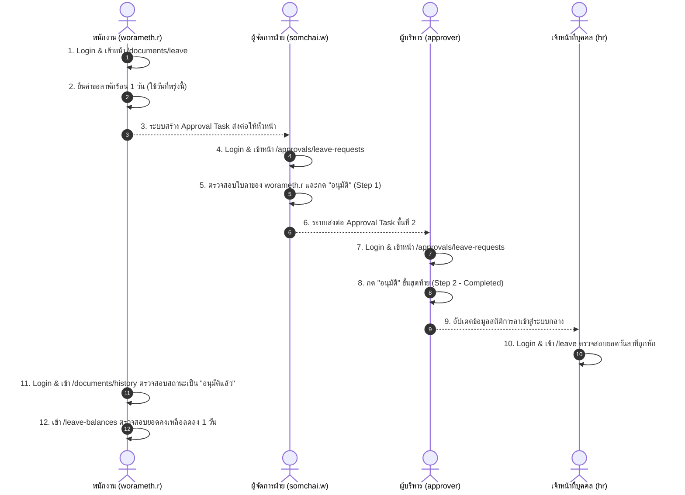

# HRMS QA Test Protocol & Role-Based Flow Hand-off
**เอกสารส่งมอบสำหรับ LLM QA Agent (Black-Box Testing & Network Activity Inspection)**

---

## 📌 บทนำและข้อกำหนดการทดสอบ (Rules of Engagement for LLM QA)

เอกสารฉบับนี้จัดทำขึ้นสำหรับ **LLM QA Agent** โดยเฉพาะ เพื่อใช้ในการทดสอบระบบบริหารงานบุคคล (Enterprise HRMS) ครบทุกฟังก์ชัน ทุกหน้าจอ และทุกบทบาท (Roles) โดยมีข้อกำหนดเคร่งครัดดังต่อไปนี้:

1. **โหมดการทดสอบแบบ Black-Box (ไม่เห็น Source Code):**
   - ผู้ทดสอบ (LLM QA) จะมองไม่เห็นซอร์สโค้ดของ Frontend หรือ Backend
   - ตรวจสอบระบบผ่าน **หน้าจอ UI จริง** (ปุ่มกด, ฟอร์มกรอกข้อมูล, ตาราง, Modal, Toast Notification, และการแสดงผล) เท่านั้น
2. **การตรวจสอบผ่าน Network Activity & Console เท่านั้น:**
   - ตรวจสอบ Network Request/Response ทุกครั้งที่มีการส่งข้อมูล (Method: `GET`, `POST`, `PUT`, `DELETE`, `OPTIONS`)
   - ตรวจสอบ HTTP Status Code:
     - `200 OK` / `201 Created` / `204 No Content` (สำเร็จ)
     - `400 Bad Request` (ข้อมูลไม่ถูกต้องตามเงื่อนไขหรือเกิด Validation Error)
     - `401 Unauthorized` (Token หมดอายุหรือไม่ได้ยืนยันตัวตน)
     - `403 Forbidden` (สิทธิ์ไม่ถึงตาม Role/Permission ที่กำหนด)
     - `404 Not Found` (ไม่พบข้อมูลหรือ API Endpoint)
     - `500 Internal Server Error` (Backend ล่มหรือเกิด Exception ภายใน)
   - ตรวจสอบ **Latency & Timeout**: หาก Request ใดใช้เวลาเกิน **15 วินาที** แล้วขึ้นแจ้งเตือน Timeout ให้บันทึกเป็น Bug ทันที
3. **การส่งมอบรายงานกลับ (Hand-off Return on Bug Found):**
   - หากพบจุดผิดปกติ (Bug, Visual Glitch, Broken Flow, หรือ Network Error) ให้บันทึกตาม **"แบบฟอร์มการส่งมอบบั๊ก (Bug Report Template)"** ที่ระบุไว้ท้ายเอกสารนี้ เพื่อส่งมอบกลับมาให้ทีมผู้พัฒนาแก้ไข

---

## 🔑 บัญชีทดสอบและสิทธิ์การเข้าใช้งาน (Login Credentials Directory)

ระบบ HRMS มีบัญชีทดสอบที่จัดเตรียมไว้ให้กดใช้งานได้ทันทีจากเมนู **"บัญชีสำหรับทดสอบ (Demo Accounts)"** ในหน้าเข้าสู่ระบบ (`/login`):

| ลำดับ | บทบาท (Role Description) | ชื่อผู้ใช้งาน (Username) | รหัสผ่าน (Password) | ขอบเขตการทำงานหลัก |
| :---: | :--- | :--- | :--- | :--- |
| **1** | **พนักงานทั่วไป** (General Employee / ESS) | `worameth.r` | `Worameth@Staff26` | บริการตนเอง (ESS), ยื่นเอกสาร, ดูวันลา, ดูเงินเดือน, บันทึกเวลา |
| **2** | **ผู้จัดการฝ่าย** (Department Manager) | `somchai.w` | `Somchai@Dept2026` | อนุมัติเอกสารระดับฝ่าย/แผนก, ดูบันทึกเวลาและตารางงานลูกทีม |
| **3** | **ผู้บริหาร / ผู้อนุมัติ** (Executive / Approver) | `approver` | `Approver@Flow2026` | อนุมัติเอกสารขั้นสุดท้าย (Final Approver), ดูแดชบอร์ดสถิติผู้บริหาร |
| **4** | **ฝ่ายการเงินและบัญชี** (Finance & Payroll) | `finance` | `Finance@Money2026` | คำนวณเงินเดือน, ภาษี/ประกันสังคม, โบนัส, ส่งออกข้อมูลธนาคาร |
| **5** | **ฝ่ายทรัพยากรบุคคล** (Human Resources) | `hr` | `Hr@2026!Pass` | จัดการพนักงาน, สัญญาจ้าง, นำเข้าเวลาสแกนนิ้ว, ปฏิทินวันหยุด, สิทธิ์วันลา |
| **6** | **ผู้ดูแลระบบสูงสุด** (Super Admin) | `admin` | `Admin#2026!Sec` | ควบคุมระบบทั้งหมด, กำหนดบทบาท/สิทธิ์ (RBAC), ตั้งค่าสายอนุมัติ, Audit Logs |

---

## 🧪 แผนการทดสอบแบบแยกตามบทบาท (Role-Based Test Flows)

---

### ROLE 1: พนักงานทั่วไป (General Employee - `worameth.r`)
> **เป้าหมาย**: ตรวจสอบฟังก์ชันบริการตนเอง (ESS) ทุกเมนู ต้องสามารถยื่นคำร้อง ติดตามสถานะ ดูสถิติส่วนบุคคลได้ และ**ต้องไม่เห็นเมนูบริหารจัดการของ Admin/HR**

#### Flow 1.1: การตรวจสอบขอบเขตเมนู (Permission Guard & Sidebar Scope)
- **ขั้นตอนการทดสอบ (Steps)**:
  1. เข้าสู่ระบบด้วย `worameth.r` / `Worameth@Staff26`
  2. สังเกตรายการเมนูบน Sidebar
- **ผลลัพธ์ที่คาดหวัง (UI Expectation)**:
  - ต้องเห็นเฉพาะกลุ่มเมนู: **ภาพรวม** (แดชบอร์ด, ข่าวสาร, ผังองค์กร), **บริการตนเอง (ESS)** (โปรไฟล์, ยื่นเอกสาร, ยอดวันลา, ปฏิทินลาทีม, บันทึกเวลา, สวัสดิการ), และ **เงินเดือนของฉัน**
  - **ต้องไม่เห็น**: เมนูพนักงาน, การเงิน/เงินเดือนภาพรวม, ตรวจบันทึกเวลา, การอนุมัติ, ข้อมูลหลัก, ตั้งค่าระบบ
- **Network Activity**:
  - `GET /api/auth/me` ➔ Status `200 OK` (คืนค่า User info, permissions มีเฉพาะ `ESS_*`)

#### Flow 1.2: ข้อมูลโปรไฟล์ของฉัน (`/profile`)
- **ขั้นตอนการทดสอบ**:
  1. คลิกเมนู "โปรไฟล์ของฉัน" (`/profile`)
  2. ตรวจสอบข้อมูลส่วนตัว, ประวัติการศึกษา, ที่อยู่, บุคคลติดต่อฉุกเฉิน, ข้อมูลบัญชีธนาคาร
  3. คลิกปุ่ม "ขอแก้ไขข้อมูลส่วนตัว" หรือแท็บ "ประวัติการขอแก้ไขข้อมูล"
- **ผลลัพธ์ที่คาดหวัง**:
  - แสดงข้อมูลของ `วรเมธ รุ่งเรือง` ถูกต้องครบถ้วน ไม่มีอาการจอขาวหรือค้าง
- **Network Activity**:
  - `GET /api/employees/me` หรือ `GET /api/employees/{id}` ➔ Status `200 OK`

#### Flow 1.3: การยื่นใบลา (`/documents/leave`)
- **ขั้นตอนการทดสอบ**:
  1. ไปที่เมนู "ยื่นเอกสาร" ➔ เลือกแท็บ "ยื่นใบลา" (`/documents/leave`)
  2. เลือก "ประเภทการลา" (เช่น ลาป่วย, ลากิจ, ลาพักร้อน)
  3. เลือกวันที่ลาโดยใช้ **ThaiDatePicker** (ตรวจสอบการแสดงผลเป็นรูปแบบ พ.ศ. `dd/mm/yyyy`)
  4. ระบุเหตุผลการลา และแนบไฟล์หลักฐาน (ถ้ามี)
  5. กดปุ่ม "ส่งคำขอลา"
- **ผลลัพธ์ที่คาดหวัง**:
  - ระบบแสดง Toast สีเขียว: "ยื่นคำขอลาสำเร็จ"
  - นำทาง (Redirect) ไปยังหน้า "ประวัติเอกสาร" (`/documents/history`) ทันที
- **Network Activity**:
  - `POST /api/leave/requests` ➔ Status `200 OK` หรือ `201 Created`
  - Payload ส่ง `leaveTypeId`, `startDate`, `endDate`, `reason`

#### Flow 1.4: การยื่นคำขออื่นๆ (Resignation, Certificate, General Request)
- **ขั้นตอนการทดสอบ**:
  1. แท็บ "ขอหนังสือรับรอง" (`/documents/certificate`): เลือกประเภทหนังสือ (รับรองเงินเดือน/การทำงาน), กรอกวัตถุประสงค์ ➔ กดส่งคำขอ
  2. แท็บ "ยื่นคำร้องทั่วไป" (`/documents/general`): กรอกหัวข้อเรื่อง, รายละเอียด ➔ กดส่งคำขอ
  3. แท็บ "ยื่นใบลาออก" (`/documents/resignation`): เลือกวันที่ต้องการมีผล (ThaiDatePicker), ระบุเหตุผล ➔ กดส่งคำขอ
- **ผลลัพธ์ที่คาดหวัง**:
  - ทุกฟอร์มส่งข้อมูลสำเร็จ แจ้งเตือน Toast ถูกต้อง และบันทึกลงประวัติเอกสาร
- **Network Activity**:
  - `POST /api/certificates/requests` ➔ Status `200 OK`
  - `POST /api/general-requests` ➔ Status `200 OK`
  - `POST /api/resignation/requests` ➔ Status `200 OK`

#### Flow 1.5: ประวัติเอกสารและการยกเลิกคำขอ (`/documents/history`)
- **ขั้นตอนการทดสอบ**:
  1. คลิกแท็บ "ประวัติเอกสาร" (`/documents/history`)
  2. ตรวจสอบตารางรายการคำขอ:
     - คอลัมน์ "ประเภทเอกสาร": ต้องแสดงเฉพาะชื่อประเภทเอกสารชัดเจน (เช่น "คำขอลาป่วย", "คำขอลาออก") ไม่แสดงเหตุผลปะปน
     - คอลัมน์ "สถานะ": แสดง Badge สถานะ (เช่น "รออนุมัติ", "อนุมัติแล้ว") โดยไม่มีข้อความสีแดง "เหตุผล: ..." ปรากฏอยู่ใต้ Badge
  3. ค้นหารายการที่มีสถานะ "รออนุมัติ" ➔ กดปุ่ม "ยกเลิกคำขอ" (Cancel)
  4. ยืนยันการยกเลิกในกล่องข้อความ
- **ผลลัพธ์ที่คาดหวัง**:
  - สถานะของรายการเปลี่ยนเป็น "ยกเลิกแล้ว" ทันที
- **Network Activity**:
  - `GET /api/documents/history` หรือ `GET /api/leave/requests/my` ➔ Status `200 OK`
  - `PUT /api/leave/requests/{id}/cancel` หรือ `DELETE` ➔ Status `200 OK`

#### Flow 1.6: ยอดวันลาคงเหลือและปฏิทินลาทีม (`/leave-balances`, `/team-leave-calendar`)
- **ขั้นตอนการทดสอบ**:
  1. คลิก "ยอดวันลาคงเหลือ" (`/leave-balances`): ตรวจสอบการ์ดสรุปโควตาลา (ทั้งหมด, ใช้ไป, คงเหลือ)
  2. คลิก "ปฏิทินการลาของทีม" (`/team-leave-calendar`): ตรวจสอบว่าเห็นวันลาของเพื่อนร่วมทีมในเดือนปัจจุบัน
- **Network Activity**:
  - `GET /api/leave/balances/my` ➔ Status `200 OK`
  - `GET /api/leave/team-calendar?month={m}&year={y}` ➔ Status `200 OK`

#### Flow 1.7: บันทึกเวลา, สวัสดิการ, และสลิปเงินเดือน (`/ess/attendance`, `/ess/benefits`, `/my-salary`)
- **ขั้นตอนการทดสอบ**:
  1. คลิก "บันทึกเวลาของฉัน" (`/ess/attendance`): ตรวจสอบรายการลงเวลาเข้า-ออกงาน
  2. คลิก "สวัสดิการของฉัน" (`/ess/benefits`): ตรวจสอบสิทธิ์ค่ารักษาพยาบาล/สวัสดิการ
  3. คลิก "เงินเดือนของฉัน" (`/my-salary`): ตรวจสอบประวัติสลิปเงินเดือนรายเดือน พร้อมปุ่มดาวน์โหลด/พิมพ์
- **Network Activity**:
  - `GET /api/attendance/daily/my` ➔ Status `200 OK`
  - `GET /api/benefits/my-balances` ➔ Status `200 OK`
  - `GET /api/payroll/my-slips` ➔ Status `200 OK`

---

### ROLE 2: ผู้จัดการฝ่าย (Department Manager - `somchai.w`)
> **เป้าหมาย**: ตรวจสอบฟังก์ชันการอนุมัติเอกสารและตรวจสอบเวลาการทำงานของลูกทีมในแผนก

#### Flow 2.1: กล่องข้อความการอนุมัติคำขอของทีม (`/approvals/leave-requests`)
- **ขั้นตอนการทดสอบ**:
  1. เข้าสู่ระบบด้วย `somchai.w` / `Somchai@Dept2026`
  2. คลิกเมนู "การอนุมัติ" (`/approvals/leave-requests`)
  3. สังเกตแท็บประเภทย่อย: "คำขอลา", "คำขอลาออก", "หนังสือรับรอง", "คำร้องทั่วไป"
  4. ตรวจสอบจำนวน Badge ตัวเลขคำขอที่รอดำเนินการ
- **ผลลัพธ์ที่คาดหวัง**:
  - รายการคำขอที่แสดงต้องเป็นคำขอของพนักงานในสังกัดฝ่ายตนเองเท่านั้น
- **Network Activity**:
  - `GET /api/approval-flows/pending-tasks` หรือ `GET /api/leave/requests/pending` ➔ Status `200 OK`

#### Flow 2.2: การดำเนินการอนุมัติและปฏิเสธ (Approve / Reject Action)
- **ขั้นตอนการทดสอบ**:
  1. เลือกคำขอลาที่ส่งมาจาก `worameth.r`
  2. ตรวจสอบรายละเอียด: ประเภทการลา, วันที่เริ่มต้น-สิ้นสุด, เหตุผล, โควตาคงเหลือ
  3. **กรณีอนุมัติ**: กดปุ่ม "อนุมัติ" (Approve) ➔ ยืนยันการทำรายการ
  4. **กรณีปฏิเสธ**: กดปุ่ม "ไม่อนุมัติ" (Reject) ➔ ระบบต้องบังคับให้กรอก "เหตุผลในการปฏิเสธ" ➔ กดยืนยัน
- **ผลลัพธ์ที่คาดหวัง**:
  - แสดง Toast สำเร็จ และรายการดังกล่าวต้องหายออกจากแท็บ "รอดำเนินการ" และไปปรากฏในแท็บ "ประวัติการอนุมัติ" (`/approvals/history`)
- **Network Activity**:
  - `POST /api/approval-flows/tasks/{id}/approve` ➔ Status `200 OK`
  - `POST /api/approval-flows/tasks/{id}/reject` ➔ Status `200 OK` (Payload มี `comment`)

#### Flow 2.3: ตรวจสอบเวลาทำงานของลูกทีม (`/attendance/daily`, `/attendance/schedules`)
- **ขั้นตอนการทดสอบ**:
  1. คลิก "ตรวจบันทึกเวลา" (`/attendance/daily`): กรองดูรายชื่อลูกทีม, ตรวจสอบสถานะ มาตรงเวลา, สาย, ขาดงาน
  2. คลิก "การจัดตารางงาน" (`/attendance/schedules`): ตรวจดูกะการทำงานของทีม
- **Network Activity**:
  - `GET /api/attendance/daily` ➔ Status `200 OK`
  - `GET /api/shifts` ➔ Status `200 OK`

---

### ROLE 3: ผู้บริหาร / ผู้อนุมัติระดับสูง (Executive / Approver - `approver`)
> **เป้าหมาย**: ตรวจสอบการอนุมัติระดับสูง (Level 2 / Executive Approval) และการดูภาพรวมองค์กร

#### Flow 3.1: การอนุมัติขั้นสุดท้าย (Final Approval Step)
- **ขั้นตอนการทดสอบ**:
  1. เข้าสู่ระบบด้วย `approver` / `Approver@Flow2026`
  2. เข้าไปที่เมนู "การอนุมัติ" (`/approvals/leave-requests`)
  3. ตรวจสอบคำขอที่ผ่านการอนุมัติจากผู้จัดการฝ่าย (`somchai.w`) มาแล้ว
  4. ทำการกด "อนุมัติ" เพื่อให้เอกสารเสร็จสมบูรณ์ (Approved Status)
- **Network Activity**:
  - `POST /api/approval-flows/tasks/{id}/approve` ➔ Status `200 OK`

#### Flow 3.2: ตรวจสอบแดชบอร์ดผู้บริหารและรายงานสถิติ (`/`, `/reports`)
- **ขั้นตอนการทดสอบ**:
  1. ดูหน้าแดชบอร์ดหลัก (`/`): กราฟสรุปจำนวนบุคลากร, อัตราการเข้างานประจำวัน
  2. ไปที่เมนู "รายงาน" (`/reports`): ตรวจสอบการแสดงผลกราฟพนักงานเข้าใหม่ และกราฟการลาออก
  3. ตรวจสอบว่าไม่มีกราฟ "สัดส่วนการมาทำงานรายแผนก" ปรากฏอยู่ตามที่มีการปรับปรุงออกไปแล้ว
- **Network Activity**:
  - `GET /api/reports/headcount` ➔ Status `200 OK`
  - `GET /api/reports/turnover` ➔ Status `200 OK`

---

### ROLE 4: ฝ่ายการเงินและบัญชี (Finance & Payroll - `finance`)
> **เป้าหมาย**: ตรวจสอบระบบบริหารเงินเดือน ภาษี ประกันสังคม กองทุน และไฟล์นำส่งธนาคาร

#### Flow 4.1: การประมวลผลรอบเงินเดือน (`/payroll`)
- **ขั้นตอนการทดสอบ**:
  1. เข้าสู่ระบบด้วย `finance` / `Finance@Money2026`
  2. เข้าเมนู "เงินเดือน" (`/payroll`)
  3. ตรวจสอบแท็บการทำงาน:
     - **รอบการจ่ายเงินเดือน**: ตรวจสอบรอบเดือนปัจจุบัน, สถานะ (แบบร่าง, คำนวณแล้ว, อนุมัติแล้ว, จ่ายแล้ว)
     - ทดลองกด "คำนวณเงินเดือน" สำหรับพนักงานทดสอบ
  4. **โครงสร้างเงินเดือน**: ตรวจสอบฐานเงินเดือน ขั้นต่ำ-ขั้นสูง
  5. **รายการได้ / รายการหัก**: ทดลองเพิ่มรายการพิเศษ เช่น เบี้ยขยัน, ค่าล่วงเวลา (OT), ค่าเดินทาง
- **ผลลัพธ์ที่คาดหวัง**:
  - การคำนวณตัวเลข รายได้รวม รายการหัก ยอดสุทธิ ถูกต้องตามหลักคณิตศาสตร์
- **Network Activity**:
  - `GET /api/payroll/periods` ➔ Status `200 OK`
  - `POST /api/payroll/calculate` ➔ Status `200 OK`

#### Flow 4.2: ภาษี ประกันสังคม และการส่งออกไฟล์ธนาคาร
- **ขั้นตอนการทดสอบ**:
  1. ตรวจสอบแท็บ "ภาษีและประกันสังคม": ตรวจสอบเพดานประกันสังคมและอัตราหัก
  2. ตรวจสอบแท็บ "รายการจ่ายธนาคาร": ทดลองกด "ดาวน์โหลดไฟล์ Text ธนาคาร" หรือ "รายงาน Excel"
- **Network Activity**:
  - `GET /api/payroll/bank-transfer` ➔ Status `200 OK` (คืนไฟล์ Blob หรือข้อมูลดาวน์โหลด)

---

### ROLE 5: ฝ่ายทรัพยากรบุคคล (Human Resources - `hr`)
> **เป้าหมาย**: ตรวจสอบการจัดการข้อมูลพนักงาน สัญญาจ้าง การนำเข้าเวลา ปฏิทินวันหยุด และสิทธิ์วันลา

#### Flow 5.1: ทะเบียนพนักงานและการแก้ไขข้อมูล (`/employees`)
- **ขั้นตอนการทดสอบ**:
  1. เข้าสู่ระบบด้วย `hr` / `Hr@2026!Pass`
  2. เข้าเมนู "พนักงาน" (`/employees`)
  3. ทดสอบการค้นหาชื่อ/รหัสพนักงาน และการกรองตามแผนก
  4. คลิกดูรายละเอียดพนักงาน (`/employees/{id}`)
  5. คลิกแก้ไขข้อมูลพนักงาน (`/employees/{id}/edit`): แก้ไขเบอร์โทร หรือตำแหน่ง ➔ บันทึก
  6. ตรวจสอบแท็บ:
     - **สัญญาจ้างงาน** (`/employees/contracts`): ตรวจสอบวันหมดอายุสัญญา
     - **การโอนย้าย** (`/employees/transfers`): ตรวจสอบประวัติการย้ายแผนก
- **Network Activity**:
  - `GET /api/employees` ➔ Status `200 OK`
  - `PUT /api/employees/{id}` ➔ Status `200 OK`

#### Flow 5.2: การนำเข้าข้อมูลเวลาสแกนนิ้ว (`/attendance/import`)
- **ขั้นตอนการทดสอบ**:
  1. เข้าเมนู "ตรวจบันทึกเวลา" ➔ "นำเข้าไฟล์เวลา" (`/attendance/import`)
  2. อัปโหลดไฟล์บันทึกเวลาทดสอบ (`.xlsx` หรือ `.csv`)
  3. ตรวจสอบ Progress Bar และสรุปผล: จำนวนแถวสำเร็จ, จำนวนแถวผิดพลาด
  4. ตรวจสอบปุ่ม "ย้อนกลับรายการ (Revert Batch)" ในตารางประวัติการนำเข้า
- **Network Activity**:
  - `POST /api/attendance/import/upload` ➔ Status `200 OK` (Timeout ตั้งไว้พิเศษ 120s)
  - `POST /api/attendance/import/batches/{id}/revert` ➔ Status `200 OK`

#### Flow 5.3: ปฏิทินวันทำงานและวันหยุด (`/work-calendar`)
- **ขั้นตอนการทดสอบ**:
  1. เข้าเมนู "วันทำงานและวันหยุด" (`/work-calendar`)
  2. ตรวจสอบรายการวันหยุดประจำปี (Public Holidays)
  3. กดปุ่ม "เพิ่มวันหยุด": กำหนดวันที่ด้วย ThaiDatePicker, ระบุชื่อวันหยุด ➔ บันทึก
  4. ตรวจสอบว่าระบบบันทึกสำเร็จโดยไม่เกิด Timeout
- **Network Activity**:
  - `GET /api/work-calendar/holidays` ➔ Status `200 OK`
  - `POST /api/work-calendar/holidays` ➔ Status `200 OK`

#### Flow 5.4: การจัดการสิทธิ์การลาและการประกาศข่าวสาร (`/leave`, `/announcements`)
- **ขั้นตอนการทดสอบ**:
  1. เข้าเมนู "การลา" (`/leave`): กำหนดประเภทการลา, ตั้งค่าโควตาวันลาพนักงาน
  2. เข้าเมนู "จัดการประกาศ" (`/announcements`): สร้างข่าวสารใหม่, เลือกกลุ่มเป้าหมาย ➔ บันทึก
- **Network Activity**:
  - `GET /api/leave/types` ➔ Status `200 OK`
  - `POST /api/announcements` ➔ Status `200 OK`

---

### ROLE 6: ผู้ดูแลระบบสูงสุด (Super Admin - `admin`)
> **เป้าหมาย**: ตรวจสอบการเข้าถึงเต็มรูปแบบ ข้อมูลหลัก การจัดการสิทธิ์ผู้ใช้งาน และระบบบันทึก Audit Logs

#### Flow 6.1: ข้อมูลหลักระบบ (Master Data Management - `/master`)
- **ขั้นตอนการทดสอบ**:
  1. เข้าสู่ระบบด้วย `admin` / `Admin#2026!Sec`
  2. เข้าเมนู "ข้อมูลหลัก" (`/master`)
  3. ตรวจสอบแท็บ:
     - **ธนาคาร (Banks)**: ตรวจสอบรายชื่อธนาคาร, รหัสธนาคาร, เพิ่ม/แก้ไขข้อมูลธนาคาร
     - **ประเภทเอกสาร (Document Types)**: ตรวจสอบและตั้งค่าประเภทเอกสาร
- **Network Activity**:
  - `GET /api/master/banks` ➔ Status `200 OK`
  - `GET /api/master/document-types` ➔ Status `200 OK`

#### Flow 6.2: การจัดการผู้ใช้ บทบาท และสายการอนุมัติ (`/settings`)
- **ขั้นตอนการทดสอบ**:
  1. เข้าเมนู "ตั้งค่าระบบ" (`/settings`)
  2. **แท็บผู้ใช้งานระบบ (Users)**:
     - ค้นหาบัญชีผู้ใช้, ตรวจสอบการผูกกับรหัสพนักงาน, รีเซ็ตรหัสผ่าน
  3. **แท็บบทบาทและสิทธิ์ (Roles & Permissions)**:
     - เลือกบทบาท (เช่น HR, Manager, Staff)
     - ตรวจสอบตาราง Matrix สิทธิ์การอ่าน/เขียน/อนุมัติ
  4. **แท็บสายการอนุมัติ (Approval Flows)**:
     - ตรวจสอบ Workflow สำหรับคำขอลา (Step 1: หัวหน้างาน ➔ Step 2: ฝ่ายบุคคล)
  5. **แท็บประวัติการใช้งาน (Audit Logs)**:
     - ตรวจสอบตารางการกระทำในระบบ: ใคร ทำอะไร ที่ IP ใด วันเวลาใด
- **Network Activity**:
  - `GET /api/users` ➔ Status `200 OK`
  - `GET /api/roles` ➔ Status `200 OK`
  - `GET /api/approval-flows` ➔ Status `200 OK`
  - `GET /api/audit-logs` ➔ Status `200 OK`

---

## 🔄 แผนทดสอบ End-to-End ข้ามบทบาท (Full Lifecycle Integration Scenario)

เพื่อทดสอบว่าระบบเชื่อมโยงระหว่างผู้ใช้งานจริงได้อย่างสมบูรณ์ ให้ LLM QA ดำเนินการทดสอบตามลำดับนี้:



---

## 📋 แบบฟอร์มการส่งมอบบั๊กกลับ (Bug Hand-off Return Template)

เมื่อ LLM QA ตรวจพบข้อผิดพลาด ให้คัดลอกแบบฟอร์มนี้ กรอกรายละเอียด และส่งกลับมาให้ทีมผู้พัฒนาทันที:

```markdown
### 🚨 [BUG REPORT] <ระบุหัวข้อบั๊กสั้นๆ กระชับและชัดเจน>

- **รหัสบั๊ก (Bug ID)**: BUG-YYYYMMDD-XX (เช่น BUG-20261007-01)
- **ระดับความรุนแรง (Severity)**: [ ] Critical (ระบบพัง/ค้าง) | [ ] High (ฟังก์ชันหลักทำงานไม่ได้) | [ ] Medium (ทำงานได้แต่ผิดพลาด) | [ ] Low (ความสวยงาม/ข้อความ)
- **บทบาทที่ใช้ทดสอบ (Tested Role)**: <เช่น worameth.r (พนักงานทั่วไป)>
- **หน้าจอที่พบปัญหา (URL & Page)**: <เช่น http://localhost:4001/documents/leave>

#### 1. ขั้นตอนการทำให้เกิดบั๊ก (Steps to Reproduce)
1. เข้าสู่ระบบด้วยบทบาท ...
2. คลิกไปที่เมนู ...
3. กรอกข้อมูลในช่อง ... เป็นค่า ...
4. กดปุ่ม ...

#### 2. ผลลัพธ์ที่คาดหวัง (Expected Result)
- <อธิบายสิ่งที่ควรจะเกิดขึ้นตามข้อกำหนด>

#### 3. ผลลัพธ์ที่เกิดขึ้นจริง (Actual Result)
- <อธิบายสิ่งที่เกิดขึ้นจริง เช่น หน้าจอค้าง, แสดง Toast สีแดงว่า ..., หรือขึ้น Timeout 15 วิ>

#### 4. หลักฐานจาก Network Activity (DevTools Network Inspection)
- **Request URL**: <เช่น POST http://localhost:5229/api/leave/requests>
- **HTTP Method**: <GET / POST / PUT / DELETE / OPTIONS>
- **HTTP Status Code**: <เช่น 400 Bad Request / 500 Internal Server Error / (Canceled / Timeout)>
- **Request Payload**:
  ```json
  <ใส่ JSON Payload ที่ส่งไป>
  ```
- **Response Body**:
  ```json
  <ใส่ JSON ข้อผิดพลาดที่ Backend ตอบกลับมา>
  ```
- **Console Log / Error Message**:
  ```text
  <ใส่ข้อความ Error จากเบราว์เซอร์ Console>
  ```

#### 5. ข้อสังเกตเพิ่มเติม (Notes / Potential Root Cause)
- <ข้อสังเกตของ QA เช่น พบอาการตอบสนองช้าผิดปกติ, ค่า Date format ส่งผิดรูปแบบ, หรือมีปัญหาเรื่องสิทธิ์>
```

---

## 🎯 มาตรฐานการตรวจรับงานของ QA (Acceptance Checklist)
- [ ] ผ่านการทดสอบครบทั้ง 6 บทบาท (Roles) โดยไม่มีสิทธิ์รั่วไหลข้าม Role
- [ ] ผ่านการทดสอบ End-to-End Leave Request Lifecycle ครบทั้ง 12 ขั้นตอน
- [ ] วันที่ทุกจุดในระบบแสดงและรับค่าเป็นรูปแบบ **พ.ศ. (`dd/mm/yyyy`)** อย่างสม่ำเสมอ
- [ ] หน้า `/documents/history` แสดงประเภทเอกสารสะอาดตา ไม่มีข้อความเหตุผลปะปน
- [ ] หน้า `/reports` แสดงกราฟพนักงานเข้าใหม่และกราฟการลาออกแยกกัน ไม่มีกราฟสัดส่วนการมาทำงานรายแผนก
- [ ] Network Activity ไม่มีคำขอใดที่ติดสถานะ `500 Internal Server Error` หรือค้างจนเกิด `Timeout`
