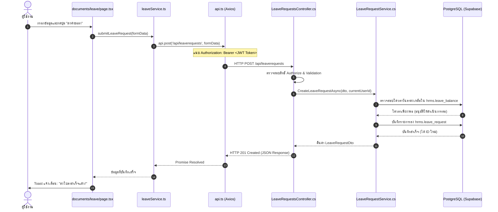

# 🏛️ HRMS Deep-Dive Architectural & Source Code Master Guide
> **คู่มือเรียนรู้โครงสร้างระบบ HRMS ฉบับเจาะลึกทุกไฟล์และตำแหน่งใน VS Code**  
> เพื่อให้เข้าใจการทำงานของโค้ด ตำแหน่งไฟล์ เขียนฟีเจอร์ใหม่ต่อเติม และแก้บั๊กได้อย่างเชี่ยวชาญ

---

## 📌 สารบัญ (Table of Contents)
1. [ภาพรวมสถาปัตยกรรมระบบ (System Architecture Overview)](#1-ภาพรวมสถาปัตยกรรมระบบ)
2. [เจาะลึก Next.js App Router & การจับคู่ URL กับไฟล์ VS Code](#2-เจาะลึก-nextjs-app-router--การจับคู่-url-กับไฟล์-vs-code)
3. [ตาราง Master Mapping: Sidebar ทุกเมนู → ไฟล์ VS Code → Components → Backend Controller](#3-ตาราง-master-mapping-sidebar-ทุกเมนู--ไฟล์-vs-code--components--backend-controller)
4. [โครงสร้าง Frontend (Client Architecture)](#4-โครงสร้าง-frontend-client-architecture)
5. [โครงสร้าง Backend (Clean Architecture 4 ชั้น)](#5-โครงสร้าง-backend-clean-architecture-4-ชั้น)
6. [วงจรการทำงานแบบ End-to-End (Data Flow Lifecycle)](#6-วงจรการทำงานแบบ-end-to-end-data-flow-lifecycle)
7. [ระบบความปลอดภัยและสิทธิ์ (Authentication & RBAC)](#7-ระบบความปลอดภัยและสิทธิ์-authentication--rbac)
8. [Workshop สอนเขียนโค้ด: การสร้างหน้าและฟีเจอร์ใหม่ตั้งแต่ศูนย์จนเสร็จ](#8-workshop-สอนเขียนโค้ด-การสร้างหน้าและฟีเจอร์ใหม่ตั้งแต่ศูนย์จนเสร็จ)
9. [เคล็ดลับและเทคนิคการแกะโค้ด (Debugging & Tracing)](#9-เคล็ดลับและเทคนิคการแกะโค้ด-debugging--tracing)

---

## 1. ภาพรวมสถาปัตยกรรมระบบ

ระบบ **HRMS (Human Resource Management System)** พัฒนาแบบแยก Frontend กับ Backend 100% เชื่อมต่อกันผ่าน RESTful JSON API:

```
[ ผู้ใช้งาน / Browser ] 
       │ (Port 3000)
       ▼
┌─────────────────────────────────────────────────────────────┐
│ FRONTEND: Next.js 16 (React 19) + TypeScript + Tailwind CSS │
│ - จัดการ Routing, State UI, Form, Validation, Interactive   │
│ - Path ในเครื่อง: C:\Project\HRMS\frontend\src             │
└──────────────────────────────┬──────────────────────────────┘
                               │ HTTP / HTTPS (JSON) + JWT Bearer Token
                               ▼
┌─────────────────────────────────────────────────────────────┐
│ BACKEND: ASP.NET Core Web API (.NET 9)                      │
│ - Clean Architecture: Domain, Application, Infra, API       │
│ - จัดการ Business Rules, RBAC, Calculations, Concurrency     │
│ - Path ในเครื่อง: C:\Project\HRMS\backend\src              │
└──────────────────────────────┬──────────────────────────────┘
                               │ Npgsql / Entity Framework Core
                               ▼
┌─────────────────────────────────────────────────────────────┐
│ DATABASE: PostgreSQL (Supabase Cloud)                       │
│ - Schema: hrms (แยก Schema ไม่ปนกับ public)                 │
└─────────────────────────────────────────────────────────────┘
```

---

## 2. เจาะลึก Next.js App Router & การจับคู่ URL กับไฟล์ VS Code

Next.js ใช้ระบบ **File-system Based Routing** กฎเหล็กมีเพียงข้อเดียว:  
👉 **"โฟลเดอร์ใดที่มีไฟล์ `page.tsx` โฟลเดอร์นั้นคือ URL ปลายทาง"**

### สัญลักษณ์พิเศษในชื่อโฟลเดอร์:

1. **`(...)` เช่น `app/(admin)/` — Route Groups**
   - **ความหมาย:** ตั้งขึ้นมาเพื่อ "จัดกลุ่มไฟล์และกำหนด Layout ร่วมกัน" **โดยไม่มีชื่อนี้ปรากฏบน URL**
   - **ตัวอย่าง:** ไฟล์ `frontend/src/app/(admin)/employees/page.tsx`  
     URL ในเบราว์เซอร์จะไม่ใช่ `/admin/employees` แต่จะเป็น **`/employees`**
   - **เหตุผลที่ทำแบบนี้:** ทำให้หน้าทุกหน้าใต้ `(admin)` ถูกหุ้มด้วย `frontend/src/app/(admin)/layout.tsx` อัตโนมัติ (ซึ่งมี Sidebar และ Navbar) ส่วนหน้า `app/login/page.tsx` อยู่นอกวงเล็บ จึงไม่มี Sidebar ติดไปด้วย

2. **`[...]` เช่น `app/(admin)/employees/[id]/` — Dynamic Route Segments**
   - **ความหมาย:** กล่องรับตัวแปรจาก URL เพื่อแสดงข้อมูลเฉพาะเจาะจง
   - **ตัวอย่าง:** เมื่อเข้า URL `/employees/42` โค้ดใน `[id]/page.tsx` จะได้ `params.id = "42"` ไปดึงข้อมูลพนักงานรหัส 42

3. **`layout.tsx` — กรอบครอบหน้าเว็บ (Layout Shell)**
   - โค้ดในไฟล์นี้จะเรนเดอร์ค้างไว้ตลอด ไม่ถูกโหลดใหม่เวลาผู้ใช้เปลี่ยนหน้า ช่วยให้ Sidebar ไม่กระตุก

---

## 3. ตาราง Master Mapping: Sidebar ทุกเมนู → ไฟล์ VS Code → Components → Backend Controller

อ้างอิงจากไฟล์เมนูหลัก: [`frontend/src/components/layout/Sidebar.tsx`](file:///C:/Project/HRMS/frontend/src/components/layout/Sidebar.tsx)

### หมวด 1: ภาพรวม (Overview)
| ชื่อเมนูใน Sidebar | URL Path | ไฟล์หน้าหลัก (Page File) | ชิ้นส่วน UI หลัก (Component) | Backend API Controller |
|---|---|---|---|---|
| **แดชบอร์ด** | `/` | `frontend/src/app/page.tsx` | `GreetingBanner`, `EmployeeStatCards`, `ManagerStatCards`, `AttendancePieChart` | `AttendanceDailyController`, `NotificationsController`, `LeaveBalancesController` |
| **ข่าวสารสำหรับฉัน** | `/my-news` | `frontend/src/app/(admin)/my-news/page.tsx` | `NewsWidget`, Announcement Cards | `AnnouncementsController` |
| **แผนผังองค์กร** | `/org-chart` | `frontend/src/app/(admin)/org-chart/page.tsx` | `components/organization/OrgChartView.tsx` | `OrganizationController` (`/api/organization/chart`) |

---

### หมวด 2: บริการตนเอง (Employee Self Service - ESS)
| ชื่อเมนูใน Sidebar | URL Path | ไฟล์หน้าหลัก (Page File) | ชิ้นส่วน UI หลัก (Component) | Backend API Controller |
|---|---|---|---|---|
| **โปรไฟล์ของฉัน** | `/profile` | `frontend/src/app/(admin)/profile/page.tsx` | `EmployeeBackgroundView`, Avatar Upload, Tab Profile | `EmployeesController` (`/api/employees/me`) |
| **ยื่นเอกสาร** | `/documents` | `frontend/src/app/(admin)/documents/page.tsx`<br>├ `/leave` (ยื่นลา)<br>├ `/resignation` (ลาออก)<br>├ `/certificate` (ขอหนังสือรับรอง)<br>├ `/general` (คำขอทั่วไป)<br>└ `/history` (ประวัติการยื่น) | `DocumentsSubNav`, `LeaveRequestModal`, `documentFormParts` | `LeaveRequestsController`<br>`ResignationController`<br>`CertificatesController`<br>`GeneralRequestsController` |
| **ยอดวันลาคงเหลือ** | `/leave-balances` | `frontend/src/app/(admin)/leave-balances/page.tsx` | Balance Cards, History Tables | `LeaveBalancesController` |
| **ปฏิทินการลาของทีม** | `/team-leave-calendar` | `frontend/src/app/(admin)/team-leave-calendar/page.tsx` | Calendar Grid, Leave Badges | `LeaveRequestsController` |
| **บันทึกเวลาของฉัน** | `/ess/attendance` | `frontend/src/app/(admin)/ess/attendance/page.tsx` | Clock In/Out Stamp, Time Log Card | `AttendanceDailyController` |
| **สวัสดิการของฉัน** | `/ess/benefits` | `frontend/src/app/(admin)/ess/benefits/page.tsx` | Benefit Cards, Claim History | `BenefitsController` |

---

### หมวด 3: การเงินและค่าตอบแทน (Payroll & Compensation)
| ชื่อเมนูใน Sidebar | URL Path | ไฟล์หน้าหลัก (Page File) | ชิ้นส่วน UI หลัก (Component) | Backend API Controller |
|---|---|---|---|---|
| **เงินเดือน (Admin/HR)** | `/payroll` | `frontend/src/app/(admin)/payroll/page.tsx` | `PayrollViewSwitcher`, `PayrollDetailDrawer`, `SalaryStructureModal`, `TaxBracketModal` | `SalaryController`, `CompanyBankAccountsController` |
| **เงินเดือนของฉัน (ESS)** | `/my-salary` | `frontend/src/app/(admin)/my-salary/page.tsx` | Payslip Card, Salary History, PDF Downloader | `MySalaryController` |

---

### หมวด 4: การจัดการบุคคล (Employee Management)
| ชื่อเมนูใน Sidebar | URL Path | ไฟล์หน้าหลัก (Page File) | ชิ้นส่วน UI หลัก (Component) | Backend API Controller |
|---|---|---|---|---|
| **พนักงาน** | `/employees` | `frontend/src/app/(admin)/employees/page.tsx`<br>├ `/[id]` (ดูข้อมูล)<br>├ `/[id]/edit` (แก้ไข)<br>├ `/types` (ประเภทพนักงาน)<br>├ `/contracts` (สัญญาจ้าง)<br>├ `/transfers` (โยกย้าย)<br>└ `/documents` (แฟ้มเอกสาร) | `EmployeeTable`, `EmployeeFilterBar`, `CreateEmployeeTypeModal`, `ContractDetailModal`, `CreateTransferModal` | `EmployeesController`<br>`EmployeeTypesController`<br>`EmploymentContractsController`<br>`EmployeeTransfersController`<br>`EmployeeDocumentsController` |
| **ยอดสวัสดิการพนักงาน** | `/benefits/balances` | `frontend/src/app/(admin)/benefits/balances/page.tsx` | Benefit Summary Table, Adjustment Modal | `BenefitsController` |
| **โครงสร้างองค์กร** | `/organization` | `frontend/src/app/(admin)/organization/page.tsx` | CompanyTab, DivisionTab, DepartmentTab, PositionTab | `OrganizationController` |
| **จัดการประกาศ** | `/announcements` | `frontend/src/app/(admin)/announcements/page.tsx` | AnnouncementEditor, TargetAudienceSelector | `AnnouncementsController` |

---

### หมวด 5: เวลาและการลา (Time & Leave)
| ชื่อเมนูใน Sidebar | URL Path | ไฟล์หน้าหลัก (Page File) | ชิ้นส่วน UI หลัก (Component) | Backend API Controller |
|---|---|---|---|---|
| **ตรวจบันทึกเวลา** | `/attendance/daily` | `frontend/src/app/(admin)/attendance/daily/page.tsx`<br>└ `/import` (นำเข้าไฟล์เวลา) | AttendanceTable, AttendanceAdjustmentModal, FileDropZone | `AttendanceDailyController`<br>`AttendanceImportController`<br>`AttendanceAdjustmentController` |
| **การจัดตารางงาน** | `/attendance/schedules` | `frontend/src/app/(admin)/attendance/schedules/page.tsx`<br>└ `/shifts` (จัดการกะเวลา) | ShiftAssignmentGrid, ShiftEditorModal | `ShiftsController`<br>`EmployeeShiftsController` |
| **การลา (Admin/HR)** | `/leave` | `frontend/src/app/(admin)/leave/page.tsx` | `LeaveTypeModal`, `LeavePolicyModal`, `AdjustBalanceModal`, `LeaveYearEndModal` | `LeaveTypesController`<br>`LeavePoliciesController`<br>`LeaveBalancesController` |
| **วันทำงานและวันหยุด** | `/work-calendar` | `frontend/src/app/(admin)/work-calendar/page.tsx` | CalendarView, HolidayEditorModal | `WorkCalendarController` |

---

### หมวด 6: การอนุมัติและรายงาน (Approvals & Reports)
| ชื่อเมนูใน Sidebar | URL Path | ไฟล์หน้าหลัก (Page File) | ชิ้นส่วน UI หลัก (Component) | Backend API Controller |
|---|---|---|---|---|
| **การอนุมัติ** | `/approvals/leave-requests` | `frontend/src/app/(admin)/approvals/leave-requests/page.tsx`<br>├ `/approvals` (ภาพรวม)<br>└ `/approvals/history` (ประวัติ) | `ApprovalNavTabs`, `ApprovalTimelineModal`, RequestCard | `ApprovalFlowsController`, `LeaveRequestsController` |
| **รายงาน** | `/reports` | `frontend/src/app/(admin)/reports/page.tsx` | Chart.js, Recharts, `LeaveSummaryReportTab`, HeadcountChart | `ReportsController`, `LeaveInsightsController` |

---

### หมวด 7: ระบบและการตั้งค่า (System & Settings)
| ชื่อเมนูใน Sidebar | URL Path | ไฟล์หน้าหลัก (Page File) | ชิ้นส่วน UI หลัก (Component) | Backend API Controller |
|---|---|---|---|---|
| **ข้อมูลหลัก (Master Data)**| `/master` | `frontend/src/app/(admin)/master/page.tsx` | LookupTable, Prefix/Nationality/Bank Config | `LookupsController`, `BanksController` |
| **ตั้งค่าระบบ** | `/settings` | `frontend/src/app/(admin)/settings/page.tsx` | `UsersTab`, `RolesTab`, `AuditLogTab`, `ApprovalFlowsTab`, `UserDrawer`, `RoleModal` | `UsersController`<br>`RolesController`<br>`AuditLogsController`<br>`ApprovalFlowsController` |

---

## 4. โครงสร้าง Frontend (Client Architecture)

```
frontend/src/
├── app/                  # Routes ทั้งหมด (ตามที่อธิบายข้างบน)
├── components/           # UI Reusable Blocks
│   ├── layout/           # Sidebar, Navbar, NotificationBell
│   ├── ui/               # ปุ่ม, CustomSelect, ThaiDatePicker, ConfirmModal
│   └── [feature]/        # Components เฉพาะโมดูล เช่น leave/, payroll/
├── services/             # ประตูติดต่อ Backend (API Layer)
├── types/                # Typescript Interface โมเดลข้อมูล
├── context/              # ตัวแปร Global ของ React (AuthContext, ToastContext)
└── hooks/                # ฟังก์ชัน React Logic เสริม (useMediaQuery)
```

### หน้าที่หลักของแต่ละโฟลเดอร์:

1. **`types/*.ts` (Data Contracts):**  
   กำหนดว่าข้อมูลหน้าตาเป็นอย่างไร ป้องกันไม่ให้เขียน key ผิดพลาด เช่น:
   ```typescript
   // frontend/src/types/leave.ts
   export interface LeaveRequest {
     id: number;
     employeeId: number;
     leaveTypeId: number;
     startDate: string;
     endDate: string;
     reason: string;
     status: 'PENDING' | 'APPROVED' | 'REJECTED';
   }
   ```

2. **`services/api.ts` (Axios Central Engine):**  
   เป็นไฟล์แม่ที่เซ็ตอัพ Axios โดยดักใส่ Header อัตโนมัติ:
   - ดึง Token จาก `localStorage.getItem('token')` มาแนบใน `Authorization: Bearer <token>`
   - เช็ค HTTP 401 ถ้าเซสชันหมดอายุ จะสั่ง Redirect ไปหน้า Login ทันที

3. **`services/*.ts` (Module Services):**  
   ฟังก์ชันติดต่อ API ของแต่ละหน้า เช่น `employeeService.ts`, `leaveService.ts` มีหน้าที่ส่ง Request ไปยัง Backend

4. **`context/AuthContext.tsx` (หัวใจของระบบสิทธิ์ใน Frontend):**  
   ทำหน้าที่จำว่า:
   - ตอนนี้ใครล็อกอินอยู่ (`user`)
   - มีฟังก์ชัน `hasPermission('EMP_PROFILE_VIEW')` ให้หน้าต่างๆ เรียกใช้ตรวจสอบก่อนแสดงปุ่มหรือเข้าหน้า

---

## 5. โครงสร้าง Backend (Clean Architecture 4 ชั้น)

Backend พัฒนาด้วย C# (.NET 9) ยึดหลัก **Clean Architecture** แบ่งเป็น 4 โปรเจกต์อย่างชัดเจน:

```
backend/src/
├── Hrms.Domain/           [ชั้นที่ 1: กฎธุรกิจหลักและฐานข้อมูล]
│   └── Entities/          # โมเดลตารางในฐานข้อมูล (C# Class = Table)
│
├── Hrms.Application/      [ชั้นที่ 2: ตรรกะการทำงาน (Business Logic)]
│   ├── Common/            # Interfaces, Models, DTOs
│   └── Features/          # Business Services แยกตามโมดูล
│
├── Hrms.Infrastructure/   [ชั้นที่ 3: ระบบภายนอกและการเชื่อมต่อ DB]
│   └── Persistence/       # DbContext (Entity Framework Core)
│
└── Hrms.Api/              [ชั้นที่ 4: จุดรับ-ส่งข้อมูลภายนอก (API Gate)]
    ├── Controllers/       # ตัวรับ HTTP Request (GET, POST, PUT, DELETE)
    ├── Middlewares/       # ดักจับ Error, ตรวจสอบ JWT
    └── Program.cs         # ไฟล์เริ่มต้นระบบ (Dependency Injection)
```

---

## 6. วงจรการทำงานแบบ End-to-End (Data Flow Lifecycle)

ขอยกตัวอย่างจังหวะที่ผู้ใช้คลิก **"ยื่นคำขอลา"** ในระบบ:



---

## 7. ระบบความปลอดภัยและสิทธิ์ (Authentication & RBAC)

ระบบใช้มาตรฐาน **Role-Based Access Control (RBAC)** ควบคู่กับ **Data Scope**:

### 1. ฝั่ง Backend (การคุ้มครองข้อมูล):
ใน Controller จะมีการกำหนดสิทธิ์ เช่น:
```csharp
[Authorize] // ต้องมี Token เท่านั้น
[HttpGet]
[RequirePermission("EMP_PROFILE_VIEW")] // ต้องมีสิทธิ์นี้ใน Role ของตน
public async Task<IActionResult> GetEmployees() { ... }
```

### 2. ฝั่ง Frontend (การคุ้มครองหน้าจอ):
ใน `Sidebar.tsx` และใน Page ต่างๆ:
```tsx
const { hasPermission, hasRole } = useAuth();

// ซ่อน/แสดง เมนูใน Sidebar
if (item.requiredPermissions && !item.requiredPermissions.some(p => hasPermission(p))) {
  return null; // ไม่แสดงเมนูนี้
}

// ในหน้า Page.tsx ถ้าแอบพิมพ์ URL เข้ามาตรงๆ
if (!hasPermission('EMP_PROFILE_VIEW')) {
  return <AccessDenied />;
}
```

---

## 8. Workshop สอนเขียนโค้ด: การสร้างหน้าและฟีเจอร์ใหม่ตั้งแต่ศูนย์จนเสร็จ

สมมติว่าคุณต้องการเพิ่มฟีเจอร์ใหม่: **"ระบบบันทึกการอบรมพนักงาน (Training)"**

### ขั้นตอนที่ 1: ฝั่ง Database & Backend
1. **สร้าง Entity:**  
   สร้างไฟล์ `backend/src/Hrms.Domain/Entities/TrainingCourse.cs`
2. **ลงทะเบียนใน DbContext:**  
   เปิด `backend/src/Hrms.Infrastructure/Persistence/HrmsDbContext.cs` เพิ่ม `public DbSet<TrainingCourse> TrainingCourses { get; set; }`
3. **สร้าง Controller:**  
   สร้างไฟล์ `backend/src/Hrms.Api/Controllers/TrainingController.cs` เพื่อเปิด API `[HttpGet]` และ `[HttpPost]`

---

### ขั้นตอนที่ 2: ฝั่ง Frontend Type & Service
1. **กำหนด Type:**  
   สร้างไฟล์ `frontend/src/types/training.ts`
   ```typescript
   export interface TrainingCourse {
     id: number;
     courseName: string;
     speaker: string;
     startDate: string;
     hours: number;
   }
   ```
2. **สร้าง Service:**  
   สร้างไฟล์ `frontend/src/services/trainingService.ts`
   ```typescript
   import api from './api';
   import { TrainingCourse } from '@/types/training';

   export const trainingService = {
     getAll: async () => {
       const res = await api.get<TrainingCourse[]>('/training');
       return res.data;
     },
   };
   ```

---

### ขั้นตอนที่ 3: ฝั่ง Frontend Page & Route
1. **สร้างไฟล์หน้าเว็บ:**  
   สร้างไฟล์ที่ `frontend/src/app/(admin)/training/page.tsx`
   ```tsx
   'use client';

   import React, { useState, useEffect } from 'react';
   import { trainingService } from '@/services/trainingService';
   import { TrainingCourse } from '@/types/training';

   export default function TrainingPage() {
     const [courses, setCourses] = useState<TrainingCourse[]>([]);
     const [loading, setLoading] = useState(true);

     useEffect(() => {
       trainingService.getAll()
         .then(data => setCourses(data))
         .catch(err => console.error(err))
         .finally(() => setLoading(false));
     }, []);

     if (loading) return <div className="p-6">กำลังโหลดข้อมูล...</div>;

     return (
       <div className="p-6 space-y-4">
         <h1 className="text-2xl font-bold text-slate-800 dark:text-white">หลักสูตรฝึกอบรม</h1>
         <div className="grid grid-cols-1 md:grid-cols-2 gap-4">
           {courses.map(course => (
             <div key={course.id} className="p-4 bg-white dark:bg-slate-800 rounded-xl shadow-sm border border-slate-200 dark:border-slate-700">
               <h3 className="font-semibold text-lg">{course.courseName}</h3>
               <p className="text-sm text-slate-500">วิทยากร: {course.speaker}</p>
             </div>
           ))}
         </div>
       </div>
     );
   }
   ```

---

### ขั้นตอนที่ 4: เชื่อมโยงเข้า Sidebar
เปิดไฟล์ `frontend/src/components/layout/Sidebar.tsx` ค้นหาหมวดที่ต้องการ แล้วแทรกเมนู:
```tsx
import { GraduationCap } from 'lucide-react'; // เลือกไอคอน

// แทรกใน menuGroups ที่ต้องการ:
{
  title: 'การอบรมและสัมมนา',
  href: '/training',
  matchPrefix: '/training',
  icon: GraduationCap,
  requiredPermissions: ['TRAINING_VIEW'],
}
```
🎉 **เสร็จสมบูรณ์! เมื่อรีเฟรชหน้าจอ เมนูใหม่จะปรากฏบน Sidebar และสามารถคลิกเข้าใช้งานได้ทันที**

---

## 9. เคล็ดลับและเทคนิคการแกะโค้ด (Debugging & Tracing)

เมื่อพบหน้าจอที่ไม่แน่ใจว่าทำงานอย่างไร ให้ใช้วิธีแกะโค้ดตามลำดับ 3 ขั้นตอนนี้:

1. **ดู URL บน Browser:**  
   เช่น อยู่ที่ `http://localhost:3000/attendance/daily`  
   → แปลว่าโค้ดอยู่ที่ `frontend/src/app/(admin)/attendance/daily/page.tsx` แน่นอน

2. **เปิด Network Tab ใน DevTools (กด F12):**  
   - ดูว่าเวลากดปุ่ม มี Request ยิงไปที่ Path ไหน (เช่น `/api/attendancedaily?date=2026-10-07`)
   - เปิด VS Code กด `Ctrl + Shift + F` (ค้นหาทั้งโปรเจกต์) ค้นคำว่า `/attendancedaily` คุณจะพบไฟล์ `Service` ที่เรียก และเจอ `Controller` ของ Backend ทันที

3. **ดูชื่อ Component ในโค้ด:**  
   เมื่อเปิดไฟล์ `page.tsx` มักจะเห็น Component ย่อยๆ ถูกเรียกใช้งาน เช่น `<AttendanceAdjustmentModal />`  
   สามารถกดปุ่ม `F12` หรือ `Ctrl + คลิกเมาส์ซ้าย` ที่ชื่อ Component ใน VS Code เพื่อกระโดดไปยังไฟล์ Component นั้นได้ทันที

---
*คู่มือนี้ได้รับการอัปเดตและซิงค์ให้ตรงกับโครงสร้างซอร์สโค้ดปัจจุบันของระบบ HRMS*
