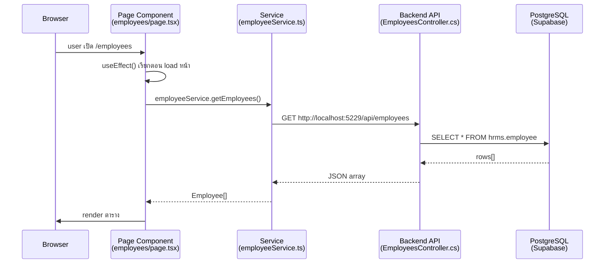

# 📘 คู่มือโปรเจค HRMS — เข้าใจจากศูนย์ถึงมือโปร

## 🗺️ ภาพรวมใหญ่ — โปรเจคนี้คืออะไร?

โปรเจคนี้คือระบบ **บริหารทรัพยากรบุคคล (HRMS)** ที่แยกเป็น 2 ส่วนหลักอยู่ใน folder เดียวกัน:

```
C:\Project\HRMS\
├── frontend/     ← เว็บที่ user เห็นและกด (Next.js + React)
└── backend/      ← เซิร์ฟเวอร์รับ-ส่งข้อมูล (.NET C#)
```

> [!IMPORTANT]
> Frontend = หน้าตา / UI ที่ browser แสดง → รันที่ `http://localhost:3000`
> Backend = API ที่ frontend เรียกเพื่อดึงข้อมูลจาก Database → รันที่ `http://localhost:5229`

---

## 🌐 Next.js App Router — เปิดหน้าไหน ไปที่ไฟล์ไหน?

นี่คือกฎที่สำคัญที่สุดของ Next.js (เวอร์ชัน 13+):

> **URL path ใน browser = folder path ใน `frontend/src/app/`**

### กฎการ Map URL → File:

| เปิด URL ใน Browser | ไฟล์ที่ทำงาน |
|---|---|
| `http://localhost:3000/` | `frontend/src/app/(admin)/page.tsx` |
| `http://localhost:3000/employees` | `frontend/src/app/(admin)/employees/page.tsx` |
| `http://localhost:3000/employees/42` | `frontend/src/app/(admin)/employees/[id]/page.tsx` |
| `http://localhost:3000/attendance/daily` | `frontend/src/app/(admin)/attendance/daily/page.tsx` |
| `http://localhost:3000/login` | `frontend/src/app/login/page.tsx` |

### `(admin)` คืออะไร?

ชื่อโฟลเดอร์ที่มีวงเล็บ `(admin)` เรียกว่า **Route Group** — Next.js จะไม่นำชื่อนั้นมาใช้เป็น URL  
ใช้เพื่อจัดกลุ่มหน้าที่ต้องการ layout เดียวกัน (Sidebar + Header)

```
app/
├── (admin)/           ← วงเล็บ = ไม่ปรากฏใน URL
│   ├── layout.tsx     ← Sidebar + Header ถูก render ตรงนี้
│   ├── page.tsx       ← หน้า Dashboard (URL: /)
│   └── employees/
│       └── page.tsx   ← หน้า Employees (URL: /employees)
└── login/
    └── page.tsx       ← หน้า Login (URL: /login) — ไม่มี Sidebar
```

### `[id]` คืออะไร?

ชื่อโฟลเดอร์ที่มีวงเล็บเหลี่ยม `[id]` = **Dynamic Route** รับค่า parameter จาก URL

```tsx
// frontend/src/app/(admin)/employees/[id]/page.tsx
export default function EmployeeDetailPage({ params }: { params: { id: string } }) {
  // params.id จะเท่ากับตัวเลขใน URL เช่น "42"
  const employeeId = params.id; // = "42"
}
```

---

## 🧭 Sidebar → File Path Mapping ฉบับสมบูรณ์

ไฟล์ Sidebar: [`Sidebar.tsx`](file:///C:/Project/HRMS/frontend/src/components/layout/Sidebar.tsx)

### กลุ่ม: ภาพรวม

| เมนูใน Sidebar | URL | ไฟล์ใน VS Code |
|---|---|---|
| แดชบอร์ด | `/` | [`(admin)/page.tsx`](file:///C:/Project/HRMS/frontend/src/app/(admin)/page.tsx) |
| ข่าวสารสำหรับฉัน | `/my-news` | [`(admin)/my-news/page.tsx`](file:///C:/Project/HRMS/frontend/src/app/(admin)/my-news/page.tsx) |
| แผนผังองค์กร | `/org-chart` | [`(admin)/org-chart/page.tsx`](file:///C:/Project/HRMS/frontend/src/app/(admin)/org-chart/page.tsx) |

### กลุ่ม: บริการตนเอง (ESS)

| เมนูใน Sidebar | URL | ไฟล์ใน VS Code |
|---|---|---|
| โปรไฟล์ของฉัน | `/profile` | [`(admin)/profile/page.tsx`](file:///C:/Project/HRMS/frontend/src/app/(admin)/profile/page.tsx) |
| ยื่นเอกสาร | `/documents` | [`(admin)/documents/leave/page.tsx`](file:///C:/Project/HRMS/frontend/src/app/(admin)/documents/leave/page.tsx) |
| ยอดวันลาคงเหลือ | `/leave-balances` | [`(admin)/leave-balances/page.tsx`](file:///C:/Project/HRMS/frontend/src/app/(admin)/leave-balances/page.tsx) |
| ปฏิทินการลาของทีม | `/team-leave-calendar` | [`(admin)/team-leave-calendar/page.tsx`](file:///C:/Project/HRMS/frontend/src/app/(admin)/team-leave-calendar/page.tsx) |
| บันทึกเวลาของฉัน | `/ess/attendance` | [`(admin)/ess/attendance/page.tsx`](file:///C:/Project/HRMS/frontend/src/app/(admin)/ess/attendance/page.tsx) |
| สวัสดิการของฉัน | `/ess/benefits` | [`(admin)/ess/benefits/page.tsx`](file:///C:/Project/HRMS/frontend/src/app/(admin)/ess/benefits/page.tsx) |

### กลุ่ม: การเงินและค่าตอบแทน

| เมนูใน Sidebar | URL | ไฟล์ใน VS Code |
|---|---|---|
| เงินเดือน | `/payroll` | [`(admin)/payroll/page.tsx`](file:///C:/Project/HRMS/frontend/src/app/(admin)/payroll/page.tsx) |
| เงินเดือนของฉัน | `/my-salary` | [`(admin)/my-salary/page.tsx`](file:///C:/Project/HRMS/frontend/src/app/(admin)/my-salary/page.tsx) |

### กลุ่ม: การจัดการบุคคล

| เมนูใน Sidebar | URL | ไฟล์ใน VS Code |
|---|---|---|
| พนักงาน | `/employees` | [`(admin)/employees/page.tsx`](file:///C:/Project/HRMS/frontend/src/app/(admin)/employees/page.tsx) |
| ยอดสวัสดิการพนักงาน | `/benefits/balances` | [`(admin)/benefits/balances/page.tsx`](file:///C:/Project/HRMS/frontend/src/app/(admin)/benefits/balances/page.tsx) |
| โครงสร้างองค์กร | `/organization` | [`(admin)/organization/page.tsx`](file:///C:/Project/HRMS/frontend/src/app/(admin)/organization/page.tsx) |
| จัดการประกาศ | `/announcements` | [`(admin)/announcements/page.tsx`](file:///C:/Project/HRMS/frontend/src/app/(admin)/announcements/page.tsx) |

### กลุ่ม: เวลาและการลา

| เมนูใน Sidebar | URL | ไฟล์ใน VS Code |
|---|---|---|
| ตรวจบันทึกเวลา | `/attendance/daily` | [`(admin)/attendance/daily/page.tsx`](file:///C:/Project/HRMS/frontend/src/app/(admin)/attendance/daily/page.tsx) |
| การจัดตารางงาน | `/attendance/schedules` | [`(admin)/attendance/schedules/page.tsx`](file:///C:/Project/HRMS/frontend/src/app/(admin)/attendance/schedules/page.tsx) |
| การลา | `/leave` | [`(admin)/leave/page.tsx`](file:///C:/Project/HRMS/frontend/src/app/(admin)/leave/page.tsx) |
| วันทำงานและวันหยุด | `/work-calendar` | [`(admin)/work-calendar/page.tsx`](file:///C:/Project/HRMS/frontend/src/app/(admin)/work-calendar/page.tsx) |

### กลุ่ม: การอนุมัติและรายงาน

| เมนูใน Sidebar | URL | ไฟล์ใน VS Code |
|---|---|---|
| การอนุมัติ | `/approvals/leave-requests` | [`(admin)/approvals/leave-requests/page.tsx`](file:///C:/Project/HRMS/frontend/src/app/(admin)/approvals/leave-requests/page.tsx) |
| รายงาน | `/reports` | [`(admin)/reports/page.tsx`](file:///C:/Project/HRMS/frontend/src/app/(admin)/reports/page.tsx) |

### กลุ่ม: ระบบและการตั้งค่า

| เมนูใน Sidebar | URL | ไฟล์ใน VS Code |
|---|---|---|
| ข้อมูลหลัก (Master Data) | `/master` | [`(admin)/master/page.tsx`](file:///C:/Project/HRMS/frontend/src/app/(admin)/master/page.tsx) |
| ตั้งค่าระบบ | `/settings` | [`(admin)/settings/page.tsx`](file:///C:/Project/HRMS/frontend/src/app/(admin)/settings/page.tsx) |

---

## 🏗️ โครงสร้าง Frontend อย่างละเอียด

```
frontend/src/
│
├── app/                         ← Next.js Pages (กำหนด URL)
│   ├── (admin)/
│   │   ├── layout.tsx           ← Layout หลัก: Sidebar + Header + content
│   │   ├── page.tsx             ← Dashboard (/)
│   │   ├── employees/
│   │   │   ├── page.tsx         ← รายชื่อพนักงาน
│   │   │   ├── [id]/page.tsx    ← ดูข้อมูลพนักงานรายคน
│   │   │   ├── [id]/edit/page.tsx ← แก้ไขพนักงาน
│   │   │   ├── types/page.tsx   ← ประเภทพนักงาน
│   │   │   ├── contracts/page.tsx ← สัญญาจ้าง
│   │   │   ├── transfers/page.tsx ← โยกย้ายพนักงาน
│   │   │   └── documents/page.tsx ← เอกสารพนักงาน
│   │   ├── attendance/
│   │   │   ├── daily/page.tsx   ← บันทึกเวลารายวัน
│   │   │   ├── import/page.tsx  ← นำเข้าข้อมูลเวลา
│   │   │   ├── schedules/page.tsx ← กำหนดตารางงาน
│   │   │   └── shifts/page.tsx  ← กะงาน
│   │   └── ...
│   └── login/
│       └── page.tsx             ← หน้าล็อกอิน (ไม่มี Sidebar)
│
├── components/                  ← ชิ้นส่วน UI ที่นำมาใช้ซ้ำ
│   ├── layout/
│   │   ├── Sidebar.tsx          ← เมนูด้านซ้าย
│   │   ├── Header.tsx           ← แถบบนสุด (ปุ่ม dark mode, notification)
│   │   └── MainLayout.tsx       ← กรอบหลักรวม Sidebar + Header
│   ├── employees/               ← Modal, Form เฉพาะหน้า employees
│   ├── leave/                   ← Modal, Form เฉพาะระบบลา
│   ├── payroll/                 ← Modal, Form เฉพาะเงินเดือน
│   ├── organization/
│   │   └── OrgChartView.tsx     ← แผนผังองค์กรแบบ interactive
│   └── ui/                      ← ชิ้นส่วนทั่วไป (ปุ่ม, Dropdown, Modal)
│       ├── CustomSelect.tsx     ← Dropdown popover แบบกำหนดเอง
│       └── ThaiDatePicker.tsx   ← ปฏิทินภาษาไทย
│
├── services/                    ← ฟังก์ชันเรียก API
│   ├── employeeService.ts       ← getEmployees(), createEmployee(), ...
│   ├── leaveService.ts          ← getLeaveTypes(), createLeaveRequest(), ...
│   └── authService.ts           ← login(), logout(), ...
│
├── types/                       ← นิยาม TypeScript (รูปร่างของข้อมูล)
│   ├── employee.ts              ← interface Employee { id, name, ... }
│   ├── leave.ts                 ← interface LeaveRequest { ... }
│   └── auth.ts                  ← interface User { ... }
│
├── context/                     ← ข้อมูลที่แชร์ทั่วทั้งแอป
│   ├── AuthContext.tsx          ← user, hasPermission(), hasRole()
│   ├── ToastContext.tsx         ← showToast() แจ้งเตือนแบบ popup
│   └── SidebarContext.tsx       ← isCollapsed, toggleSidebar()
│
└── hooks/                       ← Custom React hooks
    └── useMediaQuery.ts         ← ตรวจสอบขนาดหน้าจอ
```

---

## ⚙️ โครงสร้าง Backend อย่างละเอียด (Clean Architecture)

```
backend/src/
│
├── Hrms.Domain/                 ← ชั้นที่ 1: กฎธุรกิจ (ไม่พึ่ง framework)
│   └── Entities/                ← โมเดลข้อมูล = ตารางใน DB
│       ├── Employee.cs          ← นิยาม Employee มีฟิลด์อะไรบ้าง
│       ├── LeaveRequest.cs      ← นิยาม LeaveRequest
│       └── UserAccount.cs       ← นิยาม User/บัญชีผู้ใช้
│
├── Hrms.Application/            ← ชั้นที่ 2: Logic การทำงาน
│   ├── Features/                ← แยกเป็น Feature แต่ละอัน
│   │   ├── Employees/           ← Services ของพนักงาน
│   │   ├── Leave/               ← Services ของการลา
│   │   └── Payroll/             ← Services ของเงินเดือน
│   └── Common/Interfaces/
│       └── IHrmsDbContext.cs    ← Interface ของ Database Context
│
├── Hrms.Infrastructure/         ← ชั้นที่ 3: ติดต่อกับ DB จริง
│   └── Persistence/
│       └── HrmsDbContext.cs     ← เชื่อมต่อ PostgreSQL ผ่าน EF Core
│
└── Hrms.Api/                    ← ชั้นที่ 4: รับ HTTP Request
    ├── Controllers/             ← แต่ละ Controller = กลุ่ม API
    │   ├── EmployeesController.cs  ← GET /api/employees, POST /api/employees
    │   ├── LeaveRequestsController.cs
    │   └── AuthController.cs    ← POST /api/auth/login
    └── Program.cs               ← จุดเริ่มต้น backend (config, DI)
```

---

## 🔄 วิธีทำงานของระบบ — ตัวอย่าง "เปิดหน้าพนักงาน"



---

## 📝 โค้ดตัวอย่าง — อ่านให้เข้าใจ

### 1. Service (Frontend → Backend)

```typescript
// frontend/src/services/employeeService.ts
import apiClient from './api'; // axios instance ที่ set baseURL แล้ว

export const getEmployees = async (): Promise<Employee[]> => {
  const response = await apiClient.get('/employees'); // → GET /api/employees
  return response.data;
};

export const createEmployee = async (data: CreateEmployeeDto): Promise<Employee> => {
  const response = await apiClient.post('/employees', data); // → POST /api/employees
  return response.data;
};
```

### 2. Page Component (หน้าเว็บ)

```tsx
// frontend/src/app/(admin)/employees/page.tsx
'use client'; // บอก Next.js ว่า component นี้รันบน browser

import { useState, useEffect } from 'react';
import { getEmployees } from '@/services/employeeService'; // @/ = frontend/src/

export default function EmployeesPage() {
  const [employees, setEmployees] = useState<Employee[]>([]); // state เก็บข้อมูล
  const [loading, setLoading] = useState(true);

  useEffect(() => {
    // รันตอนหน้า load ครั้งแรก
    getEmployees()
      .then(data => setEmployees(data))
      .finally(() => setLoading(false));
  }, []); // [] = รันแค่ครั้งเดียว

  if (loading) return <div>กำลังโหลด...</div>;

  return (
    <div>
      <h1>รายชื่อพนักงาน</h1>
      <table>
        {employees.map(emp => (
          <tr key={emp.id}>
            <td>{emp.firstNameTh} {emp.lastNameTh}</td>
          </tr>
        ))}
      </table>
    </div>
  );
}
```

### 3. Controller (Backend รับ Request)

```csharp
// backend/src/Hrms.Api/Controllers/EmployeesController.cs
[ApiController]
[Route("api/[controller]")] // → /api/employees
public class EmployeesController : ControllerBase
{
    private readonly IEmployeeService _service;

    [HttpGet] // GET /api/employees
    public async Task<IActionResult> GetAll()
    {
        var employees = await _service.GetAllAsync();
        return Ok(employees); // ส่ง JSON กลับ
    }

    [HttpPost] // POST /api/employees
    public async Task<IActionResult> Create([FromBody] CreateEmployeeDto dto)
    {
        var employee = await _service.CreateAsync(dto);
        return Created($"/api/employees/{employee.Id}", employee);
    }
}
```

---

## 🔐 ระบบสิทธิ์ (RBAC)

### ตรวจสิทธิ์ใน Frontend:

```tsx
// ใน page.tsx หรือ component ไหนก็ได้
import { useAuth } from '@/context/AuthContext';

const { user, hasPermission, hasRole } = useAuth();

// ตรวจว่ามีสิทธิ์ไหม
if (!hasPermission('EMP_PROFILE_VIEW')) {
  return <AccessDenied />;
}

// ตรวจบทบาท
if (hasRole('ADMIN') || hasRole('HR_MGR')) {
  // แสดงปุ่มพิเศษ
}
```

### บทบาทหลักในระบบ:

| Role Code | บทบาท |
|---|---|
| `ADMIN` | ผู้ดูแลระบบ |
| `HR_MGR` | ผู้จัดการ HR |
| `DEPT_MGR` | ผู้จัดการแผนก |
| `LINE_MANAGER` | หัวหน้างาน |
| `EMPLOYEE` | พนักงานทั่วไป |
| `PAYROLL_ADMIN` | ผู้ดูแลเงินเดือน |
| `SYSTEM_SUPER` | Super Admin |
| `CEO` | ซีอีโอ |

---

## 🆕 วิธีสร้างหน้าใหม่ — Step by Step

สมมติอยากสร้างหน้า **"ประวัติการฝึกอบรม"** ที่ URL `/training`

### Step 1: สร้างโฟลเดอร์และไฟล์
```
frontend/src/app/(admin)/training/page.tsx
```

### Step 2: เขียน page component เบื้องต้น
```tsx
'use client';
export default function TrainingPage() {
  return <div>หน้าประวัติการฝึกอบรม</div>;
}
```

### Step 3: เพิ่มเมนูใน Sidebar.tsx
```tsx
// ใน menuGroups array — frontend/src/components/layout/Sidebar.tsx
{
  title: 'ประวัติการฝึกอบรม',
  href: '/training',
  matchPrefix: '/training',
  icon: BookOpen, // import จาก lucide-react
  requiredPermissions: ['TRAINING_VIEW'],
}
```

### Step 4: สร้าง service เรียก API (ถ้าต้องการข้อมูลจาก DB)
```typescript
// frontend/src/services/trainingService.ts
import apiClient from './api';
export const getTrainings = () => apiClient.get('/trainings').then(r => r.data);
```

### Step 5: สร้าง Type สำหรับข้อมูล
```typescript
// frontend/src/types/training.ts
export interface Training {
  id: number;
  employeeId: number;
  courseName: string;
  startDate: string;
  endDate: string;
}
```

---

## 🗃️ Services และ Types — ที่มีอยู่แล้ว

### Services (เรียก API):

| ไฟล์ | ทำอะไร |
|---|---|
| [`authService.ts`](file:///C:/Project/HRMS/frontend/src/services/authService.ts) | Login, Logout, ดึงข้อมูล user |
| [`employeeService.ts`](file:///C:/Project/HRMS/frontend/src/services/employeeService.ts) | CRUD พนักงาน |
| [`leaveService.ts`](file:///C:/Project/HRMS/frontend/src/services/leaveService.ts) | ประเภทลา, นโยบายลา, ยอดลา, คำขอลา |
| [`attendanceService.ts`](file:///C:/Project/HRMS/frontend/src/services/attendanceService.ts) | บันทึกเวลา |
| [`salaryService.ts`](file:///C:/Project/HRMS/frontend/src/services/salaryService.ts) | เงินเดือน, โครงสร้างเงินเดือน |
| [`organizationService.ts`](file:///C:/Project/HRMS/frontend/src/services/organizationService.ts) | แผนก, ตำแหน่ง, บริษัท |
| [`reportService.ts`](file:///C:/Project/HRMS/frontend/src/services/reportService.ts) | รายงานต่างๆ |
| [`settingsService.ts`](file:///C:/Project/HRMS/frontend/src/services/settingsService.ts) | Users, Roles, Audit Logs |

### API Base Config:

```typescript
// frontend/src/services/api.ts  ← ไฟล์ตั้งต้น axios
// baseURL = http://localhost:5229/api
// Authorization: Bearer <token จาก localStorage>
```

---

## 💡 Tips สำหรับมือใหม่

### อยากรู้ว่าปุ่มนี้ทำงานยังไง?
1. เปิด DevTools (F12) → Network Tab
2. กดปุ่มนั้น
3. ดู Request ที่ไปหา backend (เช่น `POST /api/employees`)
4. ค้นหา endpoint นั้นใน `controllers/` หรือ `services/`

### อยากแก้ UI สีหรือ Layout?
- ดูที่ไฟล์ `page.tsx` ของหน้านั้นโดยตรง
- Tailwind CSS: class ที่เริ่มด้วย `dark:` = สำหรับ Dark Mode
- `bg-white dark:bg-slate-800` = ขาวใน Light Mode, เทาเข้มใน Dark Mode

### อยากเพิ่ม column ในตาราง?
1. เพิ่ม field ใน `types/xxx.ts`
2. ให้ backend ส่งข้อมูลนั้นมาด้วย (แก้ Controller/Service ฝั่ง C#)
3. เพิ่ม `<td>` ในตารางของ `page.tsx`

---

## 📂 Backend Controllers — ที่มีอยู่แล้ว

| Controller | API Path | ทำอะไร |
|---|---|---|
| `AuthController.cs` | `/api/auth` | Login, JWT Token |
| `EmployeesController.cs` | `/api/employees` | CRUD พนักงาน |
| `LeaveRequestsController.cs` | `/api/leaverequests` | คำขอลา |
| `LeaveTypesController.cs` | `/api/leavetypes` | ประเภทการลา |
| `LeaveBalancesController.cs` | `/api/leavebalances` | ยอดวันลา |
| `AttendanceDailyController.cs` | `/api/attendancedaily` | บันทึกเวลา |
| `SalaryController.cs` | `/api/salary` | เงินเดือน |
| `OrganizationController.cs` | `/api/organization` | โครงสร้างองค์กร |
| `ReportsController.cs` | `/api/reports` | รายงาน |
| `UsersController.cs` | `/api/users` | บัญชีผู้ใช้ |
| `RolesController.cs` | `/api/roles` | บทบาทและสิทธิ์ |
| `AuditLogsController.cs` | `/api/auditlogs` | ประวัติการใช้งาน |
| `WorkCalendarController.cs` | `/api/workcalendar` | วันหยุด/วันทำงาน |

---

## 🗄️ Database

- **ระบบ:** PostgreSQL (ผ่าน Supabase)
- **Schema:** `hrms` (ทุกตารางอยู่ใน schema นี้)
- **ORM:** Entity Framework Core (C# → SQL อัตโนมัติ)
- **Connection:** ตั้งค่าใน [`backend/src/Hrms.Api/appsettings.json`](file:///C:/Project/HRMS/backend/src/Hrms.Api/appsettings.json)

### ตารางหลัก:
| Table | เก็บข้อมูล |
|---|---|
| `hrms.employee` | ข้อมูลพนักงาน |
| `hrms.user_account` | บัญชีผู้ใช้งานระบบ |
| `hrms.role` | บทบาท (ADMIN, HR_MGR, ...) |
| `hrms.permission` | สิทธิ์แต่ละอย่าง |
| `hrms.leave_request` | คำขอลา |
| `hrms.leave_balance` | ยอดวันลาคงเหลือ |
| `hrms.attendance_daily` | บันทึกเวลาเข้า-ออก |
| `hrms.department` | แผนก |
| `hrms.position` | ตำแหน่งงาน |
